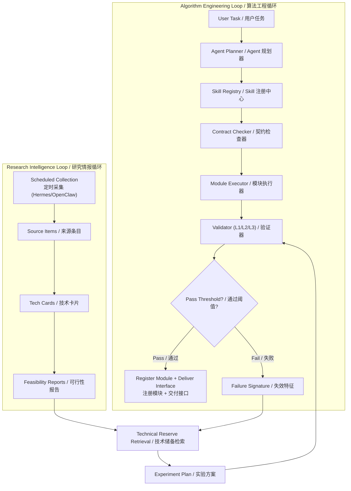
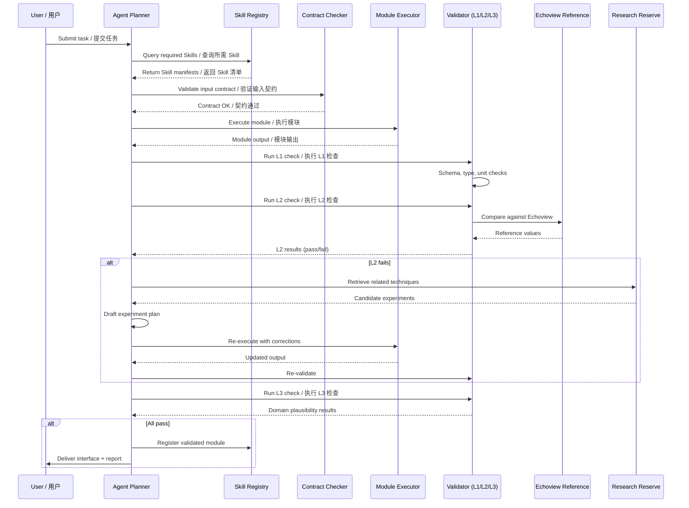
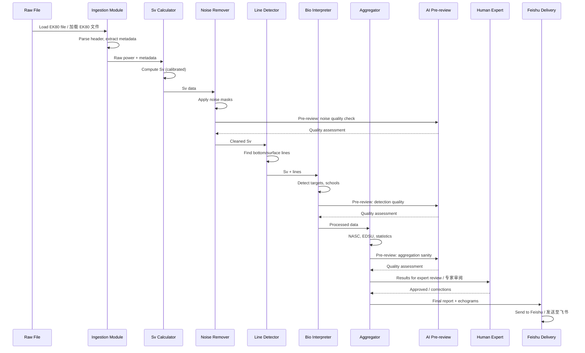
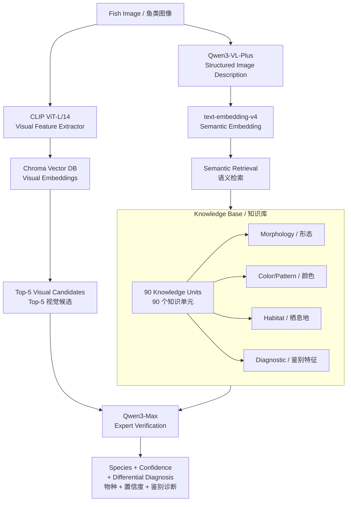
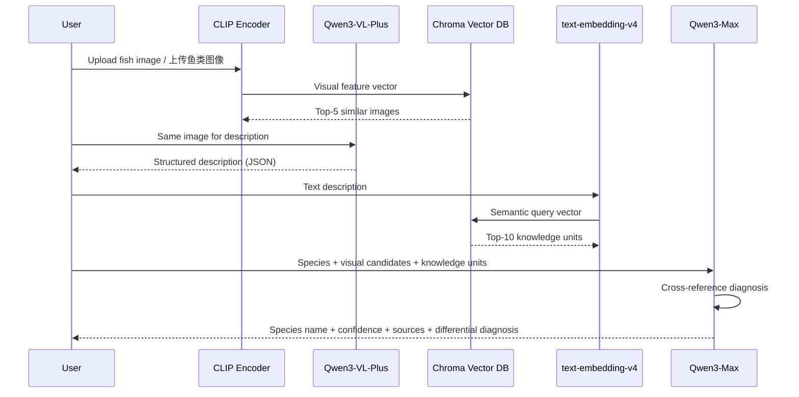
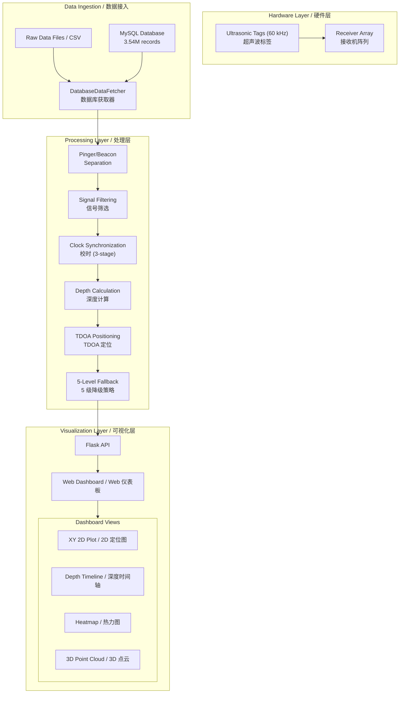
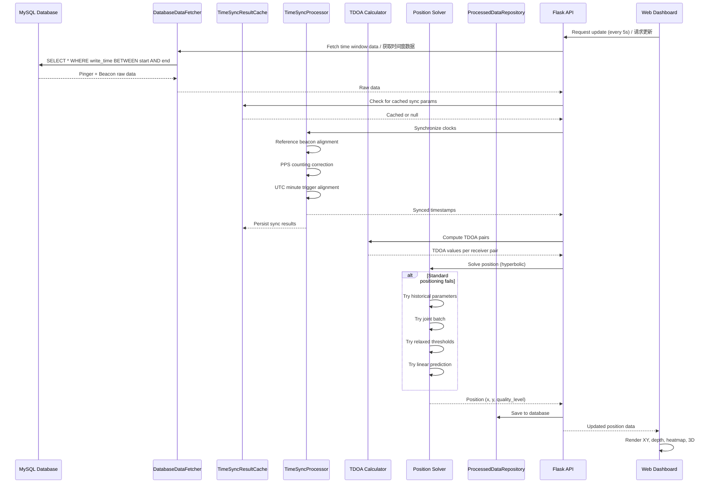
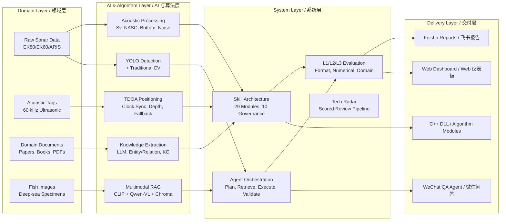

# Architecture Diagrams & Data Flows / 系统架构图与数据流

This document collects the key Mermaid architecture and data flow diagrams across the portfolio projects for centralized reference.

本文档汇总了作品集中各项目的核心 Mermaid 系统架构图与数据流图，便于集中查阅。

---

## Project 02: Agent + Skill Algorithm Engineering System

### Architecture: Two-Loop Design

### Data Flow: Agent Workflow

---

## Project 03: Sonar Data Processing Automation

### Architecture: 6-Stage Pipeline

```mermaid
flowchart LR
    subgraph Stage1["Stage 1: Data Ingestion / 数据接入"]
        A["Raw EK80/EK60 File"] --> A1["Format Detection"]
        A1 --> A2["Metadata Extraction"]
        A2 --> A3["Sample Validation"]
    end

    subgraph Stage2["Stage 2: Acoustic Variables / 声学变量"]
        A3 --> B1["Sv Calculation"]
        B1 --> B2["GPS Association"]
        B2 --> B3["Transducer Calibration"]
    end

    subgraph Stage3["Stage 3: Noise Cleaning / 噪声清洗"]
        B3 --> C1["Background Removal"]
        C1 --> C2["Impulse Filtering"]
        C2 --> C3["SNR Thresholding"]
    end

    subgraph Stage4["Stage 4: Lines & Regions / 线与区域"]
        C3 --> D1["Bottom Detection"]
        D1 --> D2["Surface Exclusion"]
        D2 --> D3["ROI Definition"]
    end

    subgraph Stage5["Stage 5: Biological / 生物解释"]
        D3 --> E1["Single Target Detection"]
        E1 --> E2["School Detection"]
        E2 --> E3["AI Pre-review"]
    end

    subgraph Stage6["Stage 6: Aggregation / 聚合报告"]
        E3 --> F1["NASC Calculation"]
        F1 --> F2["EDSU Segmentation"]
        F2 --> F3["Report & Feishu Delivery"]
    end

    A3 -.- AG["AI Decision Gate / AI 决策门"]
    C3 -.- AG
    E3 -.- AG
```

### Data Flow: Processing Pipeline

---

## Project 04: Multimodal RAG Fish Identification

### Architecture

### Data Flow

---

## Project 06: Ultrasonic Tag Positioning System

### Architecture

### Data Flow: Real-time Processing

---

## Cross-Project Data Flow / 跨项目数据流总览

