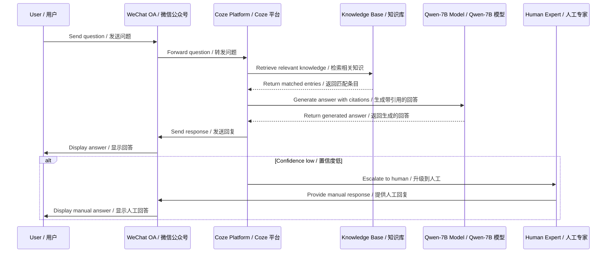

# Acoustic QA Agent / 声学问答 Agent

## STAR Summary / STAR 概述

**Situation / 背景**

Sonar products have a high knowledge barrier -- users (engineers, researchers, students, customers) repeatedly ask the same educational questions about sonar principles, product features, parameter meanings, and application scenarios. Customer support bandwidth was consumed by knowledge dissemination rather than solving real problems.

声呐产品存在较高的知识门槛。用户（工程师、研究人员、学生、客户）反复询问关于声呐原理、产品功能、参数含义和应用场景等同类教育性问题。客服资源大量消耗在知识普及上，而非解决实际问题。

**Task / 任务**

Build a deployable AI knowledge-base QA Agent that converts scattered acoustic knowledge from books, exams, papers, product documents, and expert explanations into an accessible Q&A system, deployed through WeChat official account for immediate user access.

构建一个可部署的 AI 知识库问答 Agent，将分散在书籍、试题、论文、产品文档和专家讲解中的声学知识转化为易于访问的问答系统，并通过微信公众号部署，使用户能够即时访问。

**Action / 行动**

1. Constructed knowledge taxonomy covering 3 core categories: sonar principles (acoustic equations, signal processing), product knowledge (features, parameters, applications), and domain context (marine acoustics, fisheries, underwater positioning)
2. Built dataset from heterogeneous sources: textbooks, exam Q&A banks, academic papers, product documentation, FAQ databases, and teacher-model-generated explanations (ChatGPT/Gemini/Claude as teachers)
3. Designed teacher-student strategy: large models (ChatGPT/Gemini/Claude) generate high-quality explanations, Qwen-7B is fine-tuned as the deployment model for cost efficiency
4. Crafted domain-specific prompts with acoustic expertise verification, citation requirements, and hallucination safeguards
5. Deployed via Coze and Alibaba Bailian (百炼) platforms, integrated with WeChat official account
6. Designed evaluation plan: first-answer accuracy, hallucination rate, citation coverage, human handoff rate

1. 构建了涵盖 3 个核心类别的知识分类体系：声呐原理（声学方程、信号处理）、产品知识（功能、参数、应用）和领域背景（海洋声学、渔业、水下定位）
2. 从异构来源构建数据集：教科书、考试问答库、学术论文、产品文档、FAQ 数据库以及教师模型（ChatGPT/Gemini/Claude）生成的解释
3. 设计师生策略：大模型（ChatGPT/Gemini/Claude）生成高质量解释，Qwen-7B 作为部署模型进行微调，以控制成本
4. 编写领域特定提示词，包含声学专业知识验证、引用要求和幻觉防护机制
5. 通过 Coze 和阿里巴巴百炼平台部署，与微信公众号集成
6. 设计评估方案：首次回答准确率、幻觉率、引用覆盖率、人工介入率

**Result / 结果**

- 100 core acoustic terms covered / 覆盖 100 个核心声学术语
- 3,789 knowledge descriptions in knowledge base / 知识库中 3,789 条知识描述
- 6-month trial deployment / 6 个月试运行
- 218 users served / 服务 218 位用户
- Qwen-7B fine-tuning validation completed / Qwen-7B 微调验证完成


## Problem Framing / 问题定义

### Problem / 问题陈述

Users face a high barrier when asking about sonar products and underwater acoustic concepts. Repetitive educational questions consume expert time and make product communication difficult to scale.

用户在询问声呐产品和水声学概念时面临较高的知识门槛。重复的教育类问题消耗了专家时间，使产品沟通难以规模化。

### Why AI Is Useful / 为什么 AI 适用

The problem combines domain terminology, product explanation, FAQ-style interaction, and simple scenario reasoning. A knowledge-base QA Agent can answer common questions while routing complex commercial or engineering questions to humans.

该问题融合了领域术语、产品解释、FAQ 式交互和简单场景推理。知识库问答 Agent 可以回答常见问题，同时将复杂的商业或工程问题转交给人工处理。

### System Boundary / 系统边界

**The system handles / 系统处理范围：**

- Acoustic concept explanations / 声学概念解释
- Product feature descriptions / 产品功能描述
- Parameter meaning clarification / 参数含义说明
- Application scenario guidance / 应用场景指导
- FAQ-style interactions / 常见问题式交互

**The system does NOT handle / 系统不处理范围：**

- Pricing and quotations / 定价和报价
- Customized engineering solution design / 定制化工程方案设计
- Project-specific parameter selection / 项目级参数选择
- Complex reasoning or problem-solving / 复杂推理或问题求解
- Sensitive product details / 敏感产品细节

---

## System Architecture / 系统架构

```mermaid
graph LR
    A[Knowledge Sources<br/>知识来源] --> B[Teacher Models<br/>教师模型]
    B --> C[Knowledge Base<br/>知识库]
    C --> D[Student Model<br/>学生模型]
    D --> E[Deployment Platform<br/>部署平台]
    E --> F[WeChat OA<br/>微信公众号]
    F --> G[Users<br/>用户]

    subgraph A [Knowledge Sources / 知识来源]
        A1[Books / 书籍]
        A2[Papers / 论文]
        A3[Exams / 试题]
        A4[Product Docs / 产品文档]
    end

    subgraph B [Teacher Models / 教师模型]
        B1[ChatGPT]
        B2[Gemini]
        B3[Claude]
    end

    subgraph C [Knowledge Base / 知识库]
        C1[Taxonomy / 分类体系]
        C2[Structured Descriptions / 结构化描述]
    end

    subgraph D [Student Model / 学生模型]
        D1[Qwen-7B<br/>Fine-tuned / 微调]
    end

    subgraph E [Deployment / 部署]
        E1[Coze]
        E2[Alibaba Bailian / 百炼]
    end
```



### Architecture Description / 架构说明

**Knowledge Sources (知识来源):** Textbooks on underwater acoustics, sonar-related academic papers, course exam Q&A banks, company and product introductions, and customer FAQ databases form the raw material of domain knowledge.

**Teacher Models (教师模型):** Three large language models -- ChatGPT, Gemini, and Claude -- act as teachers that generate high-quality, structured explanations from the raw knowledge sources. They expand seed terminology into comprehensive descriptions with formulas, applications, and citations.

**Knowledge Base (知识库):** A structured repository organized by a three-category taxonomy. Each entry contains a definition, formula (where applicable), application scenario, and source citation.

**Student Model (学生模型):** Qwen-7B, a smaller and more cost-effective model, is fine-tuned on the teacher-generated knowledge base. This teacher-student distillation reduces deployment cost while maintaining answer quality.

**Deployment (部署):** The system is deployed on Coze and Alibaba Bailian platforms, which provide the middleware for knowledge retrieval, prompt management, and integration.

**User Interface (用户界面):** The WeChat official account serves as the front-end, lowering the adoption barrier by meeting users in their existing communication tool.

---

## Data Flow / 数据流



### Data Flow Description / 数据流说明

1. **User Input:** A user sends a natural language question via the WeChat official account.
2. **Platform Reception:** The Coze platform receives the question via WeChat integration.
3. **Knowledge Retrieval:** The platform queries the knowledge base to find the most relevant entries matching the user question.
4. **Answer Generation:** Qwen-7B generates a response grounded in the retrieved knowledge, with citations to the source material.
5. **Response Delivery:** The answer is returned through WeChat to the user.
6. **Human Escalation (Fallback):** If the system confidence in its answer is below a threshold, or if the question involves pricing, customization, or engineering deployment, the conversation is escalated to a human expert for follow-up.

---

## Knowledge Base Design / 知识库设计

### Knowledge Categories / 知识分类

| Category / 类别 | Source / 来源 | Count / 数量 | Format / 格式 |
|---|---|---|---|
| Acoustic Terminology / 声学术语 | Textbooks, Dictionaries / 教科书、词典 | 100 terms / 100 个术语 | Definition + formula + application / 定义 + 公式 + 应用 |
| Product Knowledge / 产品知识 | Product docs, FAQ / 产品文档、FAQ | ~1,500 entries / 约 1,500 条 | Feature + parameter + use case / 功能 + 参数 + 用例 |
| Domain Application / 领域应用 | Papers, Expert notes / 论文、专家笔记 | ~2,200 entries / 约 2,200 条 | Scenario + method + limitation / 场景 + 方法 + 局限 |

### Knowledge Types / 知识类型

- **Acoustic concepts / 声学概念:** Core terminology, physical equations, signal processing fundamentals
- **Variables and formulas / 变量与公式:** Mathematical expressions with variable definitions and units
- **Sonar product descriptions / 声呐产品描述:** Product features, specifications, parameter meanings
- **Application scenarios / 应用场景:** How sonar is used in fisheries, marine surveys, underwater positioning
- **Customer FAQ / 客户常见问题:** Frequently asked operational and technical questions
- **Human handoff conditions / 人工转接条件:** Rules for when to escalate to human experts

### Design Principle / 设计原则

Knowledge should be searchable, source-aware, and suitable for non-expert explanation. Pricing, custom engineering, and sensitive product details should not be answered automatically.

知识应具备可检索性、可溯源性和面向非专业人士的可解释性。定价、定制工程和敏感产品细节不应由系统自动回答。

---

## Evaluation Design / 评估设计

### Metrics Overview / 指标概览

| Metric / 指标 | Target / 目标 | Measurement / 测量方法 |
|---|---|---|
| First-answer accuracy / 首次回答准确率 | > 85% | Expert review of random samples / 专家评审随机样本 |
| Hallucination rate / 幻觉率 | < 5% | Citation verification / 引用验证 |
| Citation coverage / 引用覆盖率 | > 90% | Source check per answer / 逐条溯源检查 |
| Human handoff rate / 人工介入率 | < 15% | Chat log analysis / 对话日志分析 |

### Detailed Evaluation Methods / 详细评估方法

| Metric / 指标 | Evaluation Method / 评估方法 |
|---|---|
| First-answer accuracy / 首次回答准确率 | Human review of 100 sampled questions / 人工评审 100 个抽样问题 |
| Basic usability rate / 基本可用率 | A/B/C/D scoring system / A/B/C/D 四档评分 |
| Hallucination rate / 幻觉率 | Unsupported answer annotation / 标注无依据回答 |
| Human handoff rate / 人工介入率 | Count questions requiring manual support / 统计需要人工支持的问题数 |
| Top-10 question categories / 十大问题类别 | Cluster historical questions / 对历史问题进行聚类分析 |

---

## Pseudocode: QA Pipeline / 伪代码

```
FUNCTION answer_user_question(user_question):
    normalized = normalize_question(user_question)
    question_type = classify(normalized)
    IF requires_human_handoff(normalized, question_type):
        RETURN contact support
    relevant_entries = retrieve_from_kb(normalized, top_k=5)
    IF relevant_entries is empty:
        RETURN apology_and_handoff()
    answer = qwen_generate(
        prompt=build_prompt(normalized, relevant_entries),
        max_length=512,
        temperature=0.3
    )
    IF hallucination_check(answer, relevant_entries) < THRESHOLD:
        answer = append_disclaimer(answer)
    RETURN answer
```

### Pipeline Description / 流水线说明

The pipeline follows a retrieval-augmented generation (RAG) pattern. Upon receiving a user question, it first normalizes and classifies the input. If the question touches pricing, customized engineering, or sensitive details, it is immediately routed to human support.
Otherwise, the system retrieves the top-5 most relevant knowledge entries, constructs a domain-specific prompt, generates an answer using Qwen-7B at a low temperature (0.3) for factual consistency, and performs a hallucination check before returning the result.

该流水线遵循检索增强生成（RAG）模式。收到用户问题后，首先进行标准化和分类。如果问题涉及定价、定制工程或敏感细节，则立即转接人工。否则，系统检索最相关的 5 条知识条目，构建领域特定提示词，使用 Qwen-7B 以低温度（0.3）生成答案以保证事实一致性，并在返回结果前执行幻觉检查。

---

## Project Retrospective / 项目复盘

### What Worked / 有效策略

**Teacher-student strategy was cost-effective / 师生策略具有成本效益**

Large models (ChatGPT, Gemini, Claude) were used to generate high-quality, structured knowledge descriptions. The smaller Qwen-7B was then fine-tuned for deployment. This approach achieved a balance between answer quality and operational cost -- large models handled the expensive knowledge generation once, while the small model handled the high-volume inference at a fraction of the cost.

大模型（ChatGPT、Gemini、Claude）用于生成高质量、结构化的知识描述，较小的 Qwen-7B 则微调用于部署。这种方法在回答质量和运营成本之间取得了平衡——大模型一次性处理高成本的知识生成，小模型以极低的成本处理大规模推理。

**Knowledge taxonomy design matters more than model choice / 知识分类设计比模型选择更重要**

Unstructured knowledge leads to inconsistent answers. The three-category taxonomy (sonar principles, product knowledge, domain context) provided a clear organizational framework that directly improved retrieval accuracy and answer consistency.

非结构化的知识会导致回答不一致。三类分类体系（声呐原理、产品知识、领域背景）提供了清晰的组织框架，直接提升了检索准确率和回答一致性。

**Citation enforcement is critical in high-expertise domains / 在高度专业领域，引用要求至关重要**

Hallucination in a domain like underwater acoustics is particularly dangerous -- incorrect formulas or parameter values could lead to real-world misunderstandings. Making citation a first-class requirement in the prompt design and validation pipeline was essential.

在水声学这样的领域，幻觉尤其危险——错误的公式或参数值可能导致现实中的误解。将引用作为提示词设计和验证流水线的首要要求至关重要。

### What Lowered Barriers / 降低门槛的因素

**WeChat deployment significantly lowered adoption barriers / 微信公众号部署大幅降低了使用门槛**

Users did not need to install a new app or learn a new interface. By meeting users in their existing communication tool (WeChat), adoption happened naturally.

用户无需安装新应用或学习新界面。通过在用户已有的通讯工具（微信）中提供服务，用户自然接受了这一产品。

### Boundaries and Limitations / 边界与局限

- Pricing, customized engineering, and project-specific parameter selection still require human follow-up / 定价、定制化工程和项目级参数选择仍需要人工跟进
- The system is designed for knowledge dissemination, not complex reasoning or problem-solving / 该系统专为知识传播设计，不适用于复杂推理或问题求解
- Public documentation does not include production prompts, private datasets, or internal platform settings / 公开文档不包含生产环境提示词、私有数据集或内部平台配置
- The system is intended for first-level Q&A, not final engineering solution design / 系统用于一级问答，而非最终工程方案设计

---

## Role-based Interpretation / 岗位化表达

### For Product Managers / 面向产品经理

This project demonstrates how to transform scattered technical knowledge into a scalable, AI-powered customer self-service channel. By deploying through WeChat, we reduced user onboarding friction to zero. The teacher-student model strategy proves that you do not need expensive API calls for every inference -- invest once in knowledge generation, then deploy cost-effectively.

本项目展示了如何将分散的技术知识转化为可扩展的 AI 驱动客户自助服务渠道。通过微信公众号部署，我们将用户上手摩擦降至零。师生模型策略证明，不需要为每次推理都调用昂贵的 API——在知识生成上一次投入，然后以低成本部署。

### For Engineers / 面向工程师

The core technical stack consists of retrieval-augmented generation (RAG) with a fine-tuned Qwen-7B model, deployed on Coze/Alibaba Bailian middleware, and integrated with WeChat. The key engineering challenge was knowledge structuring -- building a taxonomy that makes retrieval accurate and answers consistent. The hallucination detection pipeline and citation enforcement are critical components for production reliability.

核心技术栈包括基于微调 Qwen-7B 的检索增强生成（RAG），部署在 Coze/阿里云百炼中间件上，并与微信集成。关键的工程挑战是知识结构化——构建能使检索准确、回答一致的分类体系。幻觉检测流水线和引用强制机制是生产环境可靠性的关键组件。

### For Researchers / 面向研究人员

This project offers a case study in domain-specific knowledge distillation. The teacher-student paradigm (large models generating training data for a small model) is applied to a high-stakes technical domain where hallucination is unacceptable. The knowledge taxonomy design provides a reusable framework for similar domain adaptation tasks.

本项目提供了一个领域特定知识蒸馏的案例研究。师生范式（大模型为小模型生成训练数据）被应用于一个不容许幻觉的高风险技术领域。知识分类体系设计为类似的领域适配任务提供了可复用的框架。

### For Executives / 面向管理者

218 users were served in a 6-month trial with zero additional infrastructure cost beyond standard platform fees. The system freed customer support bandwidth from repetitive educational questions, allowing experts to focus on high-value engineering problems.

6 个月试运行服务了 218 位用户，除标准平台费用外无需额外基础设施成本。该系统将客服资源从重复的教育类问题中解放出来，使专家能够专注于高价值的工程问题。

---

## References / 参考资料

- [Problem Framing / 问题定义](./problem-framing.md)
- [Task Source / 任务来源](./task-source.md)
- [Data Construction / 数据构建](./data-construction.md)
- [Knowledge Base Design / 知识库设计](./knowledge-base-design.md)
- [Model Strategy / 模型策略](./model-strategy.md)
- [Prompt Design / 提示词设计](./prompt-design.md)
- [Evaluation Plan / 评估方案](./evaluation-plan.md)
- [Metrics / 指标](./metrics.md)
- [Deployment / 部署](./deployment.md)
- [Limitations / 局限](./limitations.md)
