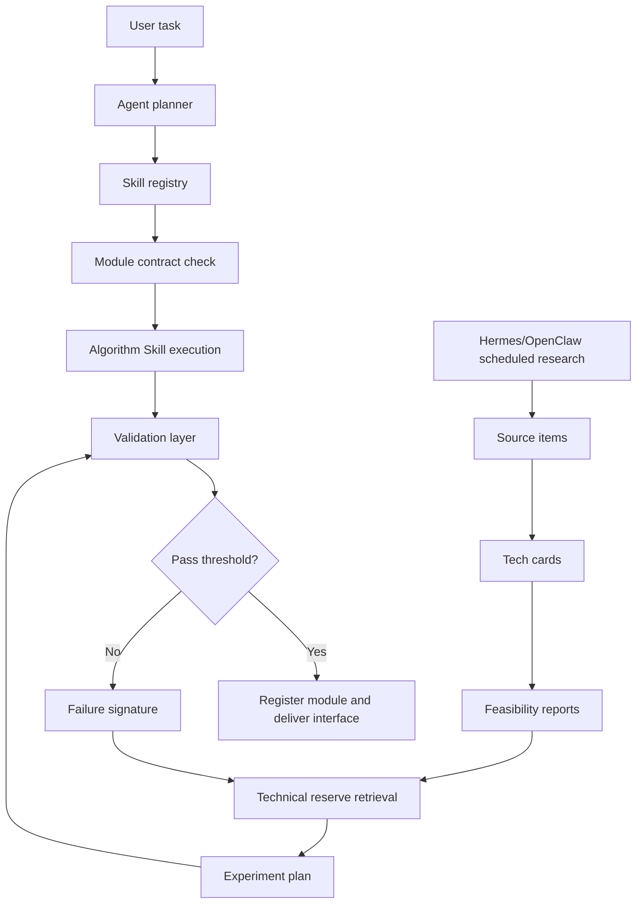

# Agent + Skill Algorithm Engineering System

## One-line Summary

An Agent + Skill system that turns acoustic algorithm knowledge, Echoview-style reference behavior, and reusable module contracts into a faster, testable algorithm development workflow.

## Core Problem

Hydroacoustic processing is difficult to productize because the knowledge is split across software behavior, papers, code repositories, parameter conventions, and field experience. A single algorithm module often requires repeated clarification of inputs, assumptions, physical constraints, boundary cases, validation data, and delivery interfaces.

The project turns that work into a reusable engineering loop: knowledge extraction, Skill constraint design, module development, grouped consistency validation, interface delivery, and later orchestration.

## What I Built

- Built a Skill-based algorithm engineering framework for acoustic processing modules.
- Converted Echoview behavior, acoustic papers, open-source code, and domain rules into structured Skill constraints.
- Designed module contracts for inputs, outputs, parameters, dependencies, validation thresholds, and known limitations.
- Used reference data and Echoview-style outputs to run consistency validation before module registration.
- Connected the algorithm Skill library to an Agent orchestration layer for task planning, module selection, AI pre-review, human review, and report delivery.
- Added a scheduled research-intelligence loop with Hermes/OpenClaw-style tasks so new AI/acoustic research can be collected, structured, and reused when existing modules fail validation.

## System Architecture

## Two Loops

### 1. Algorithm Engineering Loop

1. Knowledge extraction: extract behavior rules from Echoview, papers, open-source acoustic projects, and internal implementation notes.
2. Skill constraint design: define physical constraints, valid parameter ranges, module dependencies, expected artifacts, and failure cases.
3. Module development: implement one algorithm module under a fixed input/output contract.
4. Consistency validation: compare against reference outputs on grouped test data before registering the module.
5. Registration and delivery: store the module, Skill manifest, interface description, validation report, and downstream orchestration metadata.

### 2. Research Intelligence Loop

Hermes/OpenClaw scheduled tasks periodically collect AI/acoustic research, GitHub repositories, vendor documentation, papers, and technical notes. The system normalizes them into `source_items`, `tech_cards`, and `feasibility_reports`.

When a module cannot reach the required metric, the Agent uses the failure signature to retrieve related techniques from the reserve, drafts an experiment plan, runs slice-level and full-level tests, and gives a human reviewer a go/no-go report.

## Quantified Evidence

| Area | Metric | Value | Notes |
|---|---:|---:|---|
| Module map | Candidate acoustic modules | 29 | From Mxx module candidate mapping |
| Priority planning | P0/P1/P2/P3/D tiers | 4 / 9 / 11 / 4 / 1 | Used for phased delivery |
| Workflow governance | Management Skills | 10 | Requirement, retrieval, contract, planning, test-data, coding, validation, remediation, registration, orchestration |
| Explicit manifests | Implemented Skill manifests | 4 | Public portfolio-level evidence |
| Development efficiency | Typical module cycle | 0.5-2 days | Previously about one week for comparable modules; depends on complexity |
| Raw-to-Sv validation | Reference comparison files | 133 raw files | 38 kHz CW validation run |
| Raw-to-Sv validation | Matched pings | 1,596 | Echoview-style reference comparison |
| Raw-to-Sv validation | Valid sample comparisons | 87,047,436 | Aggregated valid cells |
| Raw-to-Sv validation | Sv RMSE | 0.050 dB | Below the 0.5 dB engineering threshold |
| Raw-to-Sv validation | Sv MAE / p95 abs diff | 0.0059 dB / 0.0038 dB | Stable for the validated slice |

## Evaluation Design

| Level | Goal | Example Metrics |
|---|---|---|
| L1 Format validation | Make sure the artifact is readable and contract-compatible | schema pass rate, missing field count, unit consistency |
| L2 Numerical validation | Compare module output with Echoview/reference output | RMSE, MAE, p95 error, max error, pass rate |
| L3 Domain validation | Check whether the result is physically and operationally usable | bottom continuity, NASC relative error, false removal rate, reviewer acceptance |

Reference thresholds:

| Module Type | Main Metric | Target |
|---|---|---:|
| Raw parser / Sv export | Sv absolute error | < 0.5 dB |
| Denoising mask | Mask IoU | > 0.85 |
| Bottom line detection | Depth error | < 1 m |
| NASC aggregation | Relative error | < 5% |
| Quality evaluation | Correct quality judgment | > 90% |
| EDSU segmentation | Segment match rate | > 95% |
| Failure alarm | False alarm rate | < 5% |

## Boundary

This project is positioned as algorithm engineering and workflow design with partial validated modules. It is not claimed as a fully mature commercial platform. Some denoising modules still require revalidation after correcting no-data semantics in historical CSV exports.