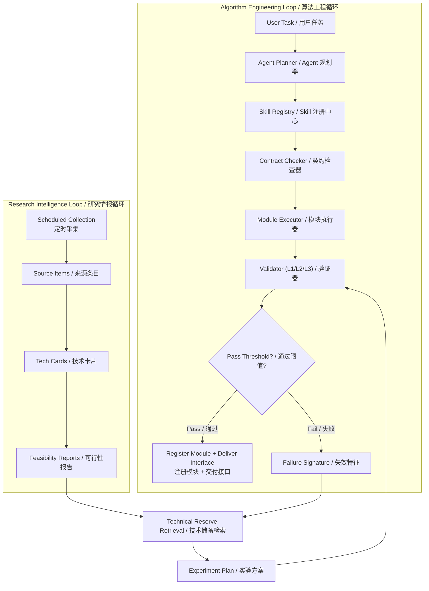
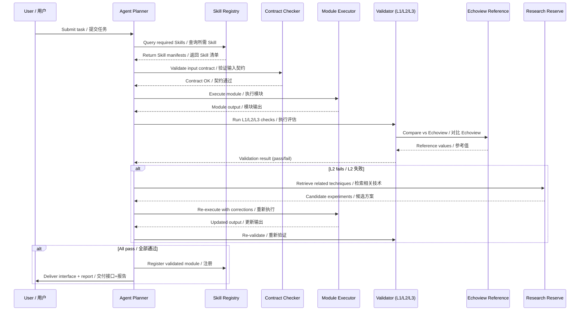

# Agent + Skill Algorithm Engineering System / Agent + Skill 算法工程化系统

## STAR Summary / STAR 概述

### Situation / 背景
Hydroacoustic processing knowledge is fragmented across Echoview software behavior, academic papers, opensource code repositories, parameter conventions, and field experience. A single algorithm module (e.g., Sv calculation, bottom detection, noise removal) requires repeated clarification of inputs, physical assumptions, constraints, boundary cases, validation data, and delivery interfaces. Without systematic knowledge engineering, each module cycle takes ~1 week and loses physical constraints during handoff between experts and developers.

水文声学处理知识分散在 Echoview 软件行为、学术论文、开源代码库、参数约定和现场经验中。一个算法模块（如 Sv 计算、底检测、去噪）需要反复澄清输入、物理假设、约束条件、边界情况和验证数据才能开发。缺乏系统化知识工程时，每个模块周期约 1 周，且在专家与开发之间交接时丢失物理约束。

### Task / 任务
Design an engineering framework that systematically converts scattered acoustic algorithm knowledge into reusable, testable, and traceable Skill modules with explicit contracts (input/output/physical constraints/dependencies/validation), connected to an Agent orchestration layer with automated evaluation at three levels (L1/L2/L3).

设计一个工程框架，系统化地将分散的声学算法知识转化为可复用、可测试、可追溯的 Skill 模块，附带显式契约（输入/输出/物理约束/依赖/验证），连接到 Agent 编排层，并实现三级自动评估（L1/L2/L3）。

### Action / 行动

| Step | Action / 行动 | Detail / 详情 |
|---|---|---|
| 1 | Knowledge Extraction / 知识提取 | Extracted behavior rules from Echoview processing, acoustic papers, opensource code, and internal implementation notes |
| 2 | Skill Contract Design / Skill 契约设计 | Defined standard Skill: input/output contract, physical constraints, valid parameter ranges, module dependencies, expected artifacts, failure cases |
| 3 | Module Development / 模块开发 | Implemented algorithm modules under fixed input/output contracts with bound physical constraints |
| 4 | Consistency Validation / 一致性验证 | Cell-level, ping-level, region-level comparison against Echoview reference on grouped test data |
| 5 | Agent Orchestration / Agent 编排 | Designed 7 Agent roles: Planner, Skill Retriever, Contract Checker, Executor, Validator, Research Retriever, Human Review Router |
| 6 | Research Intelligence Loop / 研究情报循环 | Hermes/OpenClaw scheduled collection -> source_items -> tech_cards -> feasibility_reports -> failure-triggered retrieval |
| 7 | L1/L2/L3 Evaluation / 三级评估 | L1 (Format: schema, type, unit), L2 (Numerical: RMSE, MAE, p95, IoU vs Echoview), L3 (Domain: physical plausibility, expert acceptance) |

### Result / 结果

| Metric / 指标 | Value / 数值 |
|---|---|
| Acoustic algorithm Skills defined / 声学算法 Skill | 18 (with SKILL.md manifests + contracts) |
| Governance Skills defined / 治理型 Skill | 10 |
| Candidate acoustic modules (pipeline scope) / 候选模块（流水线范围） | 29 |
| Priority tiers (P0/P1/P2/P3/D) / 优先级分层 | 4 / 9 / 11 / 4 / 1 |
| Skill contracts (typed input/output schemas) / Skill 契约 | 14 explicit SkillContract dataclasses |
| Cross-language bridge / 跨语言桥接 | C++ contract runner for CleanMatrixGenerator, NASC, SingleTarget |
| Deployment modes / 部署模式 | CLI batch + FastAPI Web + Docker Compose (web+worker) |
| Typical module cycle / 典型模块周期 | 0.5-2 days (from ~1 week) |
| Raw files compared (Sv validation) / 验证文件数 | 133 (38 kHz CW) |
| Matched pings / 匹配脉冲数 | 1,596 |
| Valid sample comparisons / 有效样本对比 | 87,047,436 |
| Sv RMSE vs Echoview / Sv RMSE | 0.050 dB (< 0.5 dB threshold) |
| Sv MAE / Sv MAE | 0.0059 dB |
| Sv p95 absolute difference / p95 绝对差 | 0.0038 dB |

## System Architecture: Two-Loop Design / 双循环架构



## Data Flow: Agent Workflow / Agent 工作流数据流



## Agent Role Design / Agent 角色设计

| Role / 角色 | Responsibility / 职责 |
|---|---|
| **Planner** | Decompose user task into required Skills |
| **Skill Retriever** | Query Skill Registry for matching manifests |
| **Contract Checker** | Validate input contract before execution |
| **Executor** | Run Skill module with bound parameters |
| **Validator** | Execute L1 (format), L2 (numerical vs Echoview), L3 (domain) checks |
| **Research Retriever** | Search tech reserve when validation fails |
| **Human Review Router** | Route ambiguous results or edge cases to domain expert |

## Implemented Acoustic Skill Catalog / 已实现的声学 Skill 目录

The EK80 Skill system defines 18 acoustic Skills, each with a `SKILL.md` manifest specifying trigger keywords, input/output contracts, domain constraints, processing order, and code location. Every Skill maps to an implementation in the `ek80_skill_system` Python package with typed input/output schemas (`SkillContract` dataclass).

EK80 Skill 系统定义了 18 个声学 Skill，每个都有 `SKILL.md` 清单，指定触发关键词、输入/输出契约、领域约束、处理顺序和代码位置。

### Pipeline Skills / 流水线 Skill

| # | Skill | Category / 类别 | Key Contract / 关键契约 |
|---|---|---|---|
| 1 | `metadata-extractor` | Data Ingestion | `.raw` file -> JSON metadata + SQLite rows + navigation |
| 2 | `ek80-calibration-governor` | Calibration | CW/FM routing, 3-level trust (external > historical > embedded), FM missing -> strict NaN |
| 3 | `ek80-sv-ts-contract` | Physical Correction | Sv_corr = Sv - 2*Gain - SaCorrection; TS_corr = TS - 2*Gain; FM spectrum interpolation |
| 4 | `ek80-vertical-power-restorer` | Signal Processing | Calibrated Sv dB -> TVG removal -> linear power restoration |
| 5 | `tvg-alpha-restorer` | Signal Processing | Fixed-alpha TVG removal with future CTD profile integration point |
| 6 | `clean-matrix-generator` | Denoising | Sv dB matrix -> noise_mask (binary) + clean_sv_db + stats.json |
| 7 | `boundary-lock` | Boundary Detection | Cleaned Sv + noise mask -> bottom_line, surface_line, boundary_stats |
| 8 | `surface-detector` | Boundary Detection | 38 kHz Sv -> surface line searching upward from 20m exclusion |
| 9 | `surface-bubble-detector` | Noise Separation | Separates bubble core and sub-surface shadow from generic noise |
| 10 | `structural-analyzer` | Biological | 38 kHz cleaned Sv -> DSL mask + school mask + school table |
| 11 | `species-discriminator` | Biological | 18/38/120 kHz multi-frequency contrasts -> species mask |
| 12 | `edsu-integrator` | Aggregation | Cleaned Sv + species mask + GPS -> EDSU-scale NASC records |
| 13 | `acoustic-nasc-integrator` | Aggregation | Linear power between surface/bottom -> NASC with Python/C++ dual runner |
| 14 | `uncertainty-analyzer` | Quality | NASC sensitivity to surface/bubble exclusion -> confidence scores |
| 15 | `ek80-split-beam-single-target` | TS Processing | TS calibration + beam compensation (alongship/athwartship offsets) |
| 16 | `ek80-batch-pipeline` | Orchestration | Batch raw files -> multi-frequency clean matrix + structural + EDSU/NASC output |
| 17 | `ek80-pipeline-orchestrator` | Orchestration | Full pipeline orchestration with calibration status passthrough, low-confidence flagging |
| 18 | `integrity-check` | Governance | Pipeline artifact completeness and consistency verification |

### Key Design Decisions / 关键设计决策

- **Calibration governance** (`ek80-calibration-governor`): FM data missing calibration curve -> strict NaN (never fallback to CW constant gain). All downgrades write `trust_level`, `confidence_label`, `report_flag`, `calibration_status` into output artifacts.
- **Contract-based interface** (`contracts.py`): 14 `SkillContract` dataclasses define typed schemas — e.g. `CleanMatrixGenerator` takes `sv_db: matrix(dB, float32, [samples, pings])` and outputs `noise_mask: matrix(binary, uint8)`. Contracts are programming-language-agnostic.
- **C++ cross-language bridge**: The `cpp_bridge/` directory provides a minimal C++ implementation conforming to the same file-level contract (JSON request + binary float32 matrices). Python and C++ runners produce identical statistics for the same inputs, proving the contract is language-independent.

## Batch Pipeline Architecture / 批处理流水线架构

The `ek80-batch-pipeline` Skill defines the standard 8-step processing order:

```
Step 1: Multi-frequency channel separation          (读取并分离多频通道)
Step 2: Metadata extraction & calibration context   (提取元数据与校准参数)
Step 3: TVG removal                                 (去 TVG)
Step 4: Denoising                                   (去噪)
Step 5: Bottom/surface boundary locking             (底线/海表锁定)
Step 6: 38 kHz structural analysis (DSL + schools)  (38 kHz 结构分析)
Step 7: Multi-frequency species discrimination      (18/38/120 kHz 物种掩码)
Step 8: EDSU / NASC aggregation with GPS range      (EDSU/NASC 统计)
```

### Deployment Architecture / 部署架构

```
┌────────────────────────────────────────────────────────────────┐
│                    EK80 Skill System / EK80 Skill 系统           │
├────────────────────────────────────────────────────────────────┤
│  ┌──────────────┐  ┌──────────────┐  ┌──────────────────────┐  │
│  │  CLI Batch   │  │  FastAPI Web │  │  Docker Compose      │  │
│  │  (cli.py)    │  │  (webapp/)   │  │  web + worker        │  │
│  └──────┬───────┘  └──────┬───────┘  └──────────┬───────────┘  │
│         │                 │                      │              │
│         v                 v                      v              │
│  ┌───────────────────────────────────────────────────────────┐  │
│  │              ek80_skill_system (Python)                    │  │
│  │  pipeline.py / contracts.py / calibration_service.py      │  │
│  │  compat.py / config.py / db.py / chunking.py              │  │
│  └───────────────────────────────────────────────────────────┘  │
│         │                                                       │
│         v                                                       │
│  ┌──────────┐  ┌──────────┐  ┌──────────┐  ┌───────────────┐  │
│  │  SQLite  │  │  MySQL   │  │  Filesys │  │  C++ Bridge   │  │
│  │  (local) │  │  (prod)  │  │  (artif.)│  │  (cpp_bridge/)│  │
│  └──────────┘  └──────────┘  └──────────┘  └───────────────┘  │
└────────────────────────────────────────────────────────────────┘
```

- **CLI**: `python -m ek80_skill_system.cli process-batch --db ... --raw-root ... --limit 20`
- **Web**: FastAPI dashboard with artifact browser, multi-frequency visualization, workflow preview
- **Docker**: `docker compose up -d` spawns `web` (FastAPI) + `worker` (batch processor)
- **Systemd**: Production deployment on Linux/DGX nodes (8+ cores, 32GB+ RAM recommended)
- **DB backends**: SQLite (default local), MySQL (production), PostgreSQL (monitoring)
- **Worker scaling**: configurable `EK80_WORKER_COUNT` (recommended 4-16 depending on I/O)

## System Design Evolution / 系统设计演进

The Skill system was designed in two complementary phases:

Skill 系统的设计分为两个互补阶段：

| Phase | Artifact / 产物 | Focus / 关注点 |
|---|---|---|
| **Phase 1: NeptuneSense Plan** | `Plan.md` (v1.0, 2026-01-12) | Agent architecture, algorithm classification (8 categories), multimodal reasoning, human-in-the-loop validation UI, auto fine-tuning loop, 4-phase roadmap (MVP -> Collaborative -> Intelligence -> Ecosystem) |
| **Phase 2: SKILL-sonar Implementation** | 18 SKILL.md manifests + `ek80_skill_system` + `cpp_bridge/` + deployment | Production-grade implementation: typed contracts, calibration governance, batch pipeline, C++ bridge, FastAPI + Docker deployment |

The NeptuneSense Plan defines the **vision** — a unified Agent system with AI-driven algorithm selection, multimodal analysis, and continuous learning. SKILL-sonar implements the **core** — structured, contract-bound acoustic processing modules that can be orchestrated by any Agent layer.

NeptuneSense Plan 定义了**愿景**——带有 AI 驱动算法选择、多模态分析和持续学习的统一 Agent 系统。SKILL-sonar 实现了**核心**——结构化的、基于契约的声学处理模块，可被任何 Agent 层编排。

## L1/L2/L3 Evaluation Design / 三级评估设计

| Level | Goal / 目标 | Metrics / 指标 | Target / 目标 |
|---|---|---|---|
| **L1 Format** | Artifact readability | Schema pass rate, type errors, unit mismatches | 100% / 0 / 0 |
| **L2 Numerical** | Numerical accuracy vs reference | RMSE, MAE, p95, max error, pass rate | [see table below] |
| **L3 Domain** | Physical & operational validity | Bottom continuity, reviewer acceptance, processing time | > 90% |

### Module-specific L2 Thresholds / 模块 L2 阈值

| Module Type / 模块类型 | Main Metric / 主指标 | Target / 阈值 |
|---|---|---|
| Raw parser / Sv export | Sv absolute error | < 0.5 dB |
| Denoising mask | Mask IoU | > 0.85 |
| Bottom line detection | Depth error | < 1 m |
| NASC aggregation | Relative error | < 5% |
| Quality evaluation | Correct quality judgment | > 90% |
| EDSU segmentation | Segment match rate | > 95% |
| Failure alarm | False alarm rate | < 5% |

## Skill Design Standard / Skill 设计标准

```
skill-name/
├── skill.md              # Purpose, constraints, domain formulas
├── references.md         # Papers, Echoview notes, code references
├── input-contract.md     # Required fields, types, units, valid ranges
├── output-contract.md    # Output fields, format, precision, units
├── pseudocode.md         # Algorithm with edge case handling
├── test-cases.md         # Representative inputs with expected outputs
├── evaluation.md         # L1/L2/L3 expectations and thresholds
├── dependencies.md       # Upstream/downstream module dependencies
└── known-issues.md       # Failure modes, edge cases, when NOT to use
```

### Governance Skills / 治理型 Skill

| Skill | Purpose / 目标 |
|---|---|
| `require-skill` | Define and bound work items |
| `retrieve-context-skill` | Fetch relevant domain documentation |
| `contract-design-skill` | Create input/output contracts from domain formulas |
| `plan-work-skill` | Generate task breakdown from contracts |
| `test-data-skill` | Prepare validation datasets |
| `coding-skill` | Execute implementation under contract |
| `validate-skill` | Run L1/L2/L3 checks |
| `remediate-skill` | Handle validation failures |
| `register-skill` | Register validated modules with manifests |
| `orchestrate-skill` | Compose modules into pipelines |

## Pseudocode: Skill Orchestrator / 伪代码

```python
class SkillOrchestrator:
    """Executes tasks through the Agent + Skill pipeline."""

    def execute_task(self, task):
        # 1. Plan: decompose task into required Skills
        required_skills = self.planner.plan(task)

        outputs = {}
        for skill_name in required_skills:
            # 2. Retrieve: find Skill manifest
            manifest = self.registry.get(skill_name)

            # 3. Contract check: validate inputs
            is_valid, issues = self.checker.validate(
                task.inputs, manifest.input_contract
            )
            if not is_valid:
                raise ContractViolation(
                    f"Input contract violated for {skill_name}: {issues}"
                )

            # 4. Execute: run the Skill
            result = self.executor.run(manifest, task.inputs)

            # 5. L1 Validation: format check
            l1_pass, l1_issues = self.validator.l1_check(
                result, manifest.output_contract
            )

            # 6. L2 Validation: numerical check vs reference
            l2_pass, l2_metrics = self.validator.l2_check(
                result, manifest.reference, manifest.module_type
            )

            # 7. L3 Validation: domain plausibility
            l3_pass, l3_issues = self.validator.l3_check(
                result, task.context, manifest.module_type
            )

            # 8. Register or recover
            if l1_pass and l2_pass and l3_pass:
                self.registry.register(manifest, result, l2_metrics)
                outputs[skill_name] = result
            else:
                # Failure recovery via research loop
                experiments = self.research_retriever.retrieve(
                    self.validator.failure_signature(result)
                )
                # Defer to human review for experiment decision
                outputs[skill_name] = self.human_review.async_review(
                    skill_name, result, experiments
                )

        return {
            "completed": self._filter_pass(outputs),
            "pending_review": self._filter_review(outputs),
            "metrics": self._aggregate_metrics(outputs)
        }
```

## Project Retrospective / 项目复盘

### What Worked / 有效方法
1. **Physical constraint binding** was the key differentiator: Skill contracts forced explicit definition of valid parameter ranges and domain boundary conditions before coding, eliminating the most common failure mode.
2. **Two-loop design** added resilience: the research intelligence loop acts as a safety net, proposing experiments when modules fail rather than blocking development.
3. **3-level evaluation** saved cost: failures caught at L1 (format) are 10x cheaper than at L3 (domain).

### Key Insights / 关键发现
- **Domain constraint binding > code style**: Exhaustively documenting what NOT to do (e.g., FM curve missing -> NaN, not silent fallback) was more impactful than elegant implementation
- **Grouped validation catches more than individual testing**: Multi-file validation consistently caught failures single-file testing missed
- **Skill manifests pay for themselves**: ~1-2 hours to produce each, saved 3-5x in debugging and knowledge transfer
- **Language-agnostic contracts unlock polyglot systems**: The C++ contract bridge proved that a well-typed JSON+binary contract works across Python and C++ with identical numerical results — enabling algorithm teams in different languages to interoperate
- **Calibration governance is the hardest problem**: The 3-level trust model (external calibration > historical backfill > embedded metadata fallback) with strict NaN-for-missing-FM policy required more design iteration than any algorithm module

### Boundaries / 边界
- **Not a commercial platform**: Partially validated modules (P0-P1 tiers solid, P2-P3 in progress). Not all 18 Skills have passed full L2 validation against Echoview
- **Echoview-dependent validation**: Numerical accuracy relies on Echoview as ground truth reference
- **Transducer-specific calibration**: Modules validated for specific transducer models (e.g., ES38B); new hardware requires re-validation
- **FM calibration gaps**: For frequency-modulated data with missing `.mat` calibration curves, the system deliberately returns `NaN` rather than silently substituting CW gain values — this is a safety feature, not a bug
- **CTD profile integration**: Absorption coefficient correction with real CTD profiles is reserved but not yet integrated
- **EDSU tail segments**: 5 nm EDSU with GPS range works; tail-segment strategy needs finalization
- **Historical data semantics**: Some legacy CSV exports had no-data semantics requiring correction before module re-registration

## Role-based Interpretation / 岗位化表达

| Role / 岗位 | Evidence / 证据 |
|---|---|
| **AI PM** | 2-loop architecture design, L1/L2/L3 evaluation governance, P0-D priority planning, 4-phase roadmap (NeptuneSense MVP->Collaborative->Intelligence->Ecosystem), deployment strategy (CLI->Web->Docker->systemd) |
| **AI App Engineer** | Agent orchestration (7 roles), Skill contract system (14 SkillContract dataclasses), FastAPI Web dashboard, MySQL/PostgreSQL/SQLite multi-backend, Docker Compose (web+worker), task status DB, artifact browser |
| **AI Solution PM** | Domain knowledge formalization (Echoview behavior -> 18 structured Skills), calibration governance design (3-level trust model), C++ cross-language contract bridge, expert workflow -> automated pipeline |
| **Algorithm Engineer** | Physical constraint binding (FM NaN policy, 2*Gain contract, no SaCorrection on TS), Echoview benchmarking (RMSE 0.050 dB, 87M samples), TVG removal with absorption correction, multi-frequency species discrimination, split-beam TS compensation |
