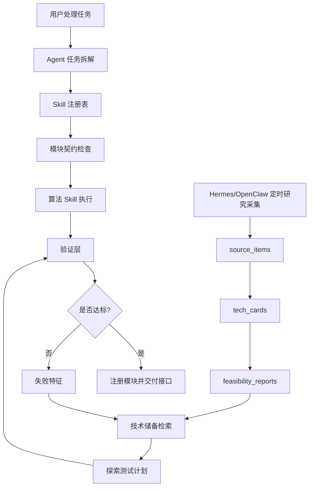

# Agent + Skill 算法工程化系统

## 一句话概述

这是一个面向声学算法工程化的 Agent + Skill 系统：把 Echoview、论文、开源代码和项目经验结构化为 Skill 约束、模块接口、验证数据和调度流程，让算法模块可以被快速开发、测试、复用和交付。

## 核心问题

水声数据处理很难直接产品化，因为关键知识分散在软件行为、论文、开源代码、参数约定和现场经验里。一个算法模块通常需要反复确认输入、假设、物理约束、边界情况、验证数据和交付接口。

这个项目把这些工作拆成可复用的工程闭环：知识提取、Skill 约束设计、模块开发、分组一致性验证、接口交付和后续 Agent 编排。

## 我做了什么

- 设计了面向声学处理模块的 Skill 化算法工程框架。
- 将 Echoview 行为、声学论文、开源项目代码和领域规则转为结构化 Skill 约束。
- 为模块定义输入、输出、参数、依赖、验证阈值和已知限制。
- 使用参考数据和 Echoview 风格输出做一致性验证，再注册模块。
- 将算法 Skill 库接入 Agent 调度层，用于任务拆解、模块选择、AI 预审、人工复审和报告交付。
- 增加 Hermes/OpenClaw 风格的定时技术储备流程，让 AI/声学新研究可以被采集、结构化，并在现有模块指标不达标时反向支撑开发探索。

## 系统架构

## 两个闭环

### 1. 算法工程化闭环

1. 知识提取：从 Echoview、论文、开源声学项目和内部实现记录中提取行为规则。
2. Skill 约束设计：定义物理约束、参数范围、模块依赖、预期产物和失败情况。
3. 模块开发：在固定输入输出契约下实现单个算法模块。
4. 一致性验证：在分组测试数据上与参考输出对比，验证通过后注册模块。
5. 注册交付：沉淀模块、Skill manifest、接口说明、验证报告和后续调度元数据。

### 2. 技术储备闭环

Hermes/OpenClaw 定时任务周期性采集 AI/声学研究、GitHub 仓库、厂商文档、论文和技术笔记，并结构化为 `source_items`、`tech_cards` 和 `feasibility_reports`。

当某个模块无法达到指标时，Agent 会根据失败特征检索技术储备，生成探索测试计划，先做切片验证，再做完整验证，最终给人工评审一个可决策的 go/no-go 报告。

## 量化证据

| 领域 | 指标 | 数值 | 说明 |
|---|---:|---:|---|
| 模块地图 | 候选声学模块 | 29 | 来自 Mxx 模块候选映射 |
| 优先级规划 | P0/P1/P2/P3/D | 4 / 9 / 11 / 4 / 1 | 用于分阶段交付 |
| 流程治理 | Management Skills | 10 | 需求、检索、契约、计划、测试数据、编码、验证、修复、注册、编排 |
| 显式 manifest | 已整理 Skill manifest | 4 | 公开作品集层面的证据 |
| 开发效率 | 典型模块周期 | 0.5-2 天 | 之前同类模块约一周，实际取决于复杂度 |
| Raw-to-Sv 验证 | 对比 raw 文件 | 133 | 38 kHz CW 验证运行 |
| Raw-to-Sv 验证 | 匹配 ping | 1,596 | Echoview 风格参考对比 |
| Raw-to-Sv 验证 | 有效样本对比 | 87,047,436 | cell 级聚合对比 |
| Raw-to-Sv 验证 | Sv RMSE | 0.050 dB | 低于 0.5 dB 工程阈值 |
| Raw-to-Sv 验证 | Sv MAE / p95 绝对误差 | 0.0059 dB / 0.0038 dB | 验证切片表现稳定 |

## 评估设计

| 层级 | 目标 | 示例指标 |
|---|---|---|
| L1 格式验证 | 确保产物可读且满足契约 | schema 通过率、缺失字段数、单位一致性 |
| L2 数值验证 | 与 Echoview/参考输出对比 | RMSE、MAE、p95 误差、最大误差、通过率 |
| L3 领域验证 | 判断结果是否满足物理和业务可用性 | 底线连续性、NASC 相对误差、误删率、人工认可率 |

参考阈值：

| 模块类型 | 主指标 | 目标 |
|---|---|---:|
| Raw 解析 / Sv 导出 | Sv 绝对误差 | < 0.5 dB |
| 去噪掩膜 | Mask IoU | > 0.85 |
| 底线检测 | 深度误差 | < 1 m |
| NASC 聚合 | 相对误差 | < 5% |
| 质量评价 | 判断正确率 | > 90% |
| EDSU 分段 | 分段匹配率 | > 95% |
| 失败告警 | 误报率 | < 5% |

## 边界说明

这个项目定位为算法工程化和工作流设计，包含部分已验证模块，不声明为完整成熟的商业平台。部分历史去噪模块需要在修正 no-data 语义后重新验证，不能直接作为最终生产证据。

## 补充设计文档

- [声学 Agent 系统架构](./acoustic-agent-architecture.zh-CN.md)
- [流程指标、数据治理与接口设计](./process-metrics-data-interface.zh-CN.md)
- [专家确认、经验入库与结构化表达](./expert-knowledge-ingestion.zh-CN.md)
