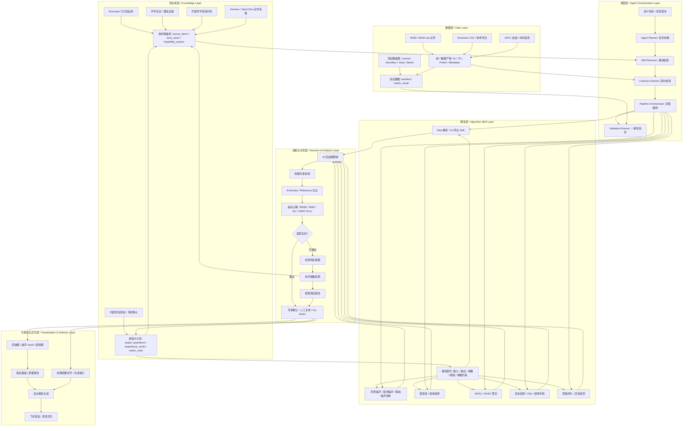

# 声学 Agent 系统架构

## 架构定位

这个声学 Agent 不是单纯的问答系统，也不是单个算法脚本。它的定位是一个“知识库 + 数据治理 + 算法 Skill + Agent 调度 + AI 预审 + 专家复审 + 报告交付”的工程系统。

系统目标有三个：

1. 把 Echoview、论文、开源代码、内部经验和专家判断变成可复用的结构化知识。
2. 把 EK80/EK60 raw 数据处理拆成可验证、可回归、可交付的算法模块。
3. 当算法指标不达标时，自动回到技术储备和经验库中寻找改进方向，形成“失败 - 检索 - 探索 - 验证 - 专家确认 - 入库”的闭环。

## 总体架构图

## 分层说明

| 层级 | 作用 | 关键产物 |
|---|---|---|
| 知识库层 | 汇聚 Echoview、论文、开源代码、内部经验和专家判断 | source_items、tech_cards、feasibility_reports、experience_cards |
| 数据层 | 统一 raw、CSV、GPS、测试数据和验证结果 | raw manifest、artifact manifest、validation_case、metric_result |
| 算法层 | 将声学算法封装为 Skill，并绑定契约和阈值 | Skill manifest、module contract、parameter schema |
| 调度层 | 根据任务自动拆解流程、选择 Skill、检查契约并执行流水线 | task graph、pipeline plan、execution log |
| 决策与分析层 | 做 AI 预审、参考对比、指标计算、失败分析和专家复审 | validation report、failure signature、go/no-go decision |
| 可视化与交付层 | 输出回波图、质量报告、结果文件和飞书交付物 | echogram、dashboard、report、delivery package |

## 核心闭环

1. 新任务进入后，Agent Planner 将需求拆成数据解析、预处理、算法处理、验证和报告几个阶段。
2. Skill Retriever 根据数据类型、频率、目标指标和模块依赖选择候选 Skill。
3. Contract Checker 检查输入、输出、参数、单位、no-data 语义和物理约束。
4. Pipeline Orchestrator 执行模块并生成标准产物。
5. Validation Runner 计算 RMSE、MAE、IoU、NASC 相对误差、底线误差等指标。
6. 若结果通过阈值，进入专家确认和交付；若不通过，生成 failure signature，检索技术储备并进入探索测试。
7. 专家确认后的判断被结构化为经验卡片，回写到知识库和 Skill 约束中。
