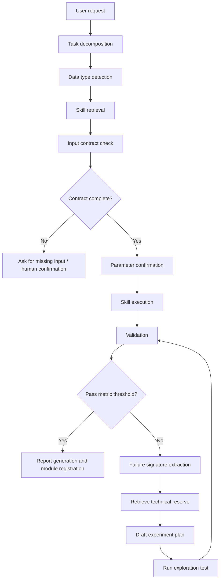

# Agent Orchestration

## Agent Responsibilities

| Agent Role | Responsibility | Output |
|---|---|---|
| Planner | Break user goal into acoustic processing tasks | task graph |
| Skill Retriever | Find candidate Skills and dependencies | ranked Skill list |
| Contract Checker | Verify input/output, units, parameters, and no-data semantics | contract report |
| Executor | Run the selected algorithm module | artifacts and logs |
| Validator | Compare against reference outputs and physical constraints | validation report |
| Research Retriever | Query the technical reserve when validation fails | candidate techniques |
| Human Review Router | Escalate uncertain decisions | review task |

## Human Confirmation Triggers

- Required input is missing.
- The selected Skill does not match the data type or frequency mode.
- Parameter ranges are outside the Skill definition.
- Output is outside physical/acoustic constraints.
- Reference comparison fails the target threshold.
- A new technique is suggested from the technical reserve and requires implementation cost approval.

## Failure-driven Research Loop

When a module fails, the Agent records a failure signature instead of blindly retrying parameters: module name and version, input data profile, failed metric and threshold, error distribution, suspected cause, and related acoustic concept or algorithm family.

The signature is used to retrieve `tech_cards` from the technical reserve. Candidate techniques are converted into an experiment plan, then tested on slice data before full validation. The human reviewer receives a report containing metric deltas, risk, integration cost, and a recommended decision.