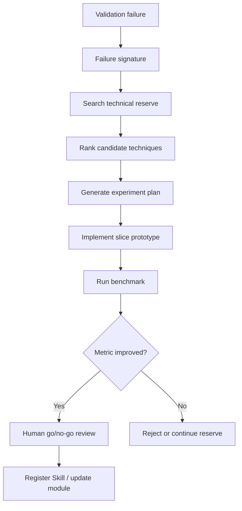

# Research Intelligence Loop

## Purpose

The research intelligence loop keeps the algorithm system connected to new AI/acoustic research. It is designed for proactive reserve and failure recovery.

## Scheduled Collection

Hermes and OpenClaw-style scheduled tasks run daily or weekly collection jobs.

| Source Type | Examples | Stored As |
|---|---|---|
| Papers | acoustic processing, fishery acoustics, AI signal processing | `source_items` |
| GitHub repositories | README, releases, issues, stars, licenses | `source_items` |
| Vendor documentation | Echoview, Simrad, sensor manuals | `source_items` |
| Technical blogs/forums | implementation notes and edge cases | `source_items` |
| Internal notes | field experience, validation reports, failed experiments | `source_items` |

## Structured Storage

- `source_items`: raw but normalized evidence with title, url, publisher, published time, summary, license note, content hash, duplicate relation, confidence, collecting agent, and review status.
- `tech_cards`: decision-ready technical cards with problem, method, evidence strength, TRL 1-9, suitable scenarios, requirements, validation method, integration complexity, risk, owner, reviewer, and decision.
- `feasibility_reports`: experiment-facing reports with conclusion, evidence, scenario fit, validation plan, expected effort, risks, and recommendation.

## Failure-triggered Exploration

## Metrics

| Metric | Formula | Interpretation |
|---|---|---|
| Collection volume | valid source items per run | Whether the reserve is growing |
| Duplicate rate | `duplicate_items / collected_items` | Whether collection is noisy |
| Extraction completeness | `filled_required_fields / required_fields` | Whether records are usable by Agents |
| Review acceptance rate | `accepted_cards / reviewed_cards` | Whether AI structuring is reliable |
| Retrieval precision@K | `relevant_candidates_in_top_k / k` | Whether failures can find useful knowledge |
| Experiment conversion rate | `experiments_started / retrieved_candidates` | Whether retrieved knowledge is actionable |
| Technique win rate | `accepted_techniques / tested_techniques` | Whether exploration produces value |
| Failure recovery latency | `report_time - failure_time` | How quickly the system responds to algorithm failure |