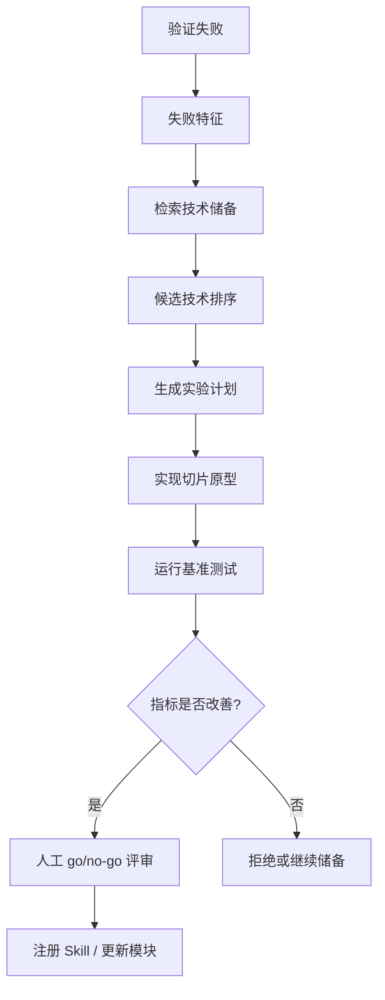

# 技术储备与自动探索闭环

## 目标

技术储备闭环让算法系统持续连接新的 AI/声学研究，主要服务两个场景：

1. 主动储备：在项目真正需要之前，持续沉淀可能有用的方法。
2. 失败恢复：当现有算法指标不达标时，自动检索相关技术并组织探索测试。

## 定时采集

Hermes 和 OpenClaw 风格的定时任务按日或按周运行。

| 来源类型 | 示例 | 入库对象 |
|---|---|---|
| 论文 | 声学处理、渔业声学、AI 信号处理 | `source_items` |
| GitHub 仓库 | README、release、issue、star、license | `source_items` |
| 厂商文档 | Echoview、Simrad、传感器手册 | `source_items` |
| 技术博客/论坛 | 实现笔记和边界案例 | `source_items` |
| 内部记录 | 现场经验、验证报告、失败实验 | `source_items` |

## 结构化入库

- `source_items`：标准化原始证据，包含标题、URL、发布方、发布时间、摘要、license、content hash、去重关系、置信度、采集 agent 和审查状态。
- `tech_cards`：面向决策的技术卡片，包含问题、方法、证据强度、TRL 1-9、适用场景、依赖要求、验证方法、集成复杂度、风险、负责人、评审人和决策。
- `feasibility_reports`：面向实验的可行性报告，包含结论、证据、场景匹配度、验证计划、预期工作量、风险和建议。

## 失败触发探索

## 量化指标

| 指标 | 计算方式 | 含义 |
|---|---|---|
| 采集量 | 每次有效 source item 数 | 技术储备是否增长 |
| 重复率 | `duplicate_items / collected_items` | 采集噪声是否过高 |
| 抽取完整度 | `filled_required_fields / required_fields` | 记录是否能被 Agent 使用 |
| 评审通过率 | `accepted_cards / reviewed_cards` | AI 结构化是否可靠 |
| Retrieval precision@K | `relevant_candidates_in_top_k / k` | 失败后是否能找到相关知识 |
| 实验转化率 | `experiments_started / retrieved_candidates` | 检索结果是否可行动 |
| 技术胜率 | `accepted_techniques / tested_techniques` | 探索是否产生价值 |
| 失败恢复耗时 | `report_time - failure_time` | 系统响应算法失败的速度 |
