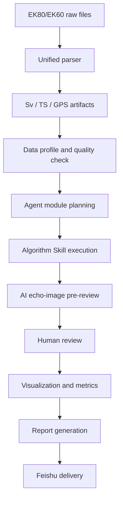

# Sonar Data Processing Automation

## One-line Summary

An Agent-orchestrated EK80/EK60 processing workflow that standardizes raw data parsing, acoustic module execution, AI pre-review, human review, visualization, reporting, and Feishu delivery.

## Core Problem

Sonar processing is usually fragmented across raw files, Echoview projects, parameter sheets, exported CSVs, manual screenshots, and final reports. The result is slow iteration, weak reproducibility, and high dependency on individual experience.

This project turns that workflow into a modular pipeline with measurable stages and review gates.

## Processing Pipeline

## Modules

| Stage | Example Modules | Output |
|---|---|---|
| Data ingestion | raw parser, Echoview CSV parser, GPS merge | normalized artifacts |
| Acoustic variables | Sv, TS, SvNoTVG, power conversion | numeric arrays and metadata |
| Cleaning | background noise, impulse noise, transient noise, median filter | cleaned echogram |
| Lines and regions | surface line, bottom line, bad data mask | masks and lines |
| Biological interpretation | DSL extraction, target bitmap, frequency discrimination | analysis layers |
| Aggregation/reporting | EDSU, NASC, metrics, figures, report | final deliverables |

## AI Decision Workflow

The AI layer is not used as a blind replacement for acoustic algorithms. It is used for pre-reviewing echograms, selecting candidate modules, checking physical constraints, generating summaries, and routing uncertain cases to human review.

## Quantified Evidence

| Metric | Value | Meaning |
|---|---:|---|
| Validated raw files | 133 | 38 kHz CW raw-to-Sv reference comparison |
| Matched pings | 1,596 | paired with reference output |
| Valid sample comparisons | 87,047,436 | cell-level comparison count |
| Sv RMSE | 0.050 dB | below 0.5 dB engineering threshold |
| Sv MAE | 0.0059 dB | stable validated slice |
| Sv p95 absolute difference | 0.0038 dB | stable validated slice |
| Demo SDK output | 6 transducers | pipeline artifact generation test |
| Demo SDK pings | 12 pings per transducer | small pipeline run |
| CSV cleaning sample | 1,747 x 4,006 | historical exported echogram table |
| Non-empty columns retained | 2,402 | 59.96% retained after empty-column removal |

## Current Boundary

The raw-to-Sv comparison has strong numeric evidence for the validated 38 kHz CW slice. Some historical cleaning and bottom-detection experiments are kept as evidence of exploration, but are not claimed as production-ready because no-data semantics and abnormal bottom-line cases still require revalidation.