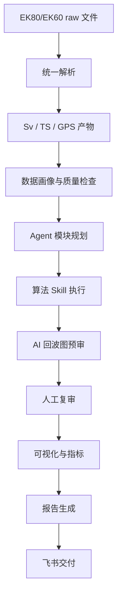

# 声呐数据处理自动化

## 一句话概述

这是一个面向 EK80/EK60 的 Agent 编排处理流程，用于标准化 raw 数据解析、声学模块执行、AI 预审、人工复审、可视化、报告生成和飞书交付。

## 核心问题

声呐处理通常分散在 raw 文件、Echoview 工程、参数表、导出 CSV、人工截图和最终报告中。结果是迭代慢、可复现性弱，并且高度依赖个人经验。

这个项目将流程拆成可度量的模块化流水线，并设置验证和复审关口。

## 处理流程

## 模块

| 阶段 | 示例模块 | 输出 |
|---|---|---|
| 数据接入 | raw parser、Echoview CSV parser、GPS merge | 标准化产物 |
| 声学变量 | Sv、TS、SvNoTVG、power conversion | 数组与元数据 |
| 数据清洗 | 背景噪声、脉冲噪声、瞬态噪声、中值滤波 | 清洗后的回波图 |
| 线和区域 | 表层线、底线、坏数据 mask | mask 与 line |
| 生物解释 | DSL、target bitmap、频率判别 | 分析层 |
| 聚合与报告 | EDSU、NASC、指标、图件、报告 | 最终交付物 |

## AI 决策工作流

AI 层不是替代声学算法，而是用于：回波图预审、可疑区域标记、根据数据画像选择候选模块、检查物理约束、生成复审摘要、将不确定情况交给人工。

## 量化证据

| 指标 | 数值 | 含义 |
|---|---:|---|
| 已验证 raw 文件 | 133 | 38 kHz CW raw-to-Sv 参考对比 |
| 匹配 ping | 1,596 | 与参考输出配对 |
| 有效样本对比 | 87,047,436 | cell 级对比数量 |
| Sv RMSE | 0.050 dB | 低于 0.5 dB 工程阈值 |
| Sv MAE | 0.0059 dB | 验证切片稳定 |
| Sv p95 绝对误差 | 0.0038 dB | 验证切片稳定 |
| Demo SDK 输出 | 6 个 transducer | 流水线产物生成测试 |
| Demo SDK ping | 每个 transducer 12 个 ping | 小规模流水线运行 |
| CSV 清洗样本 | 1,747 x 4,006 | 历史导出回波图表 |
| 保留非空列 | 2,402 | 删除空列后保留 59.96% |

## 当前边界

raw-to-Sv 对比在 38 kHz CW 验证切片上有较强数值证据。历史清洗和底线检测实验仅作为探索证据保留，不声明为生产就绪，因为 no-data 语义和异常底线情况仍需重新验证。
