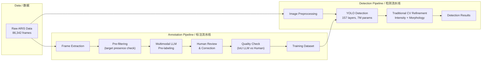
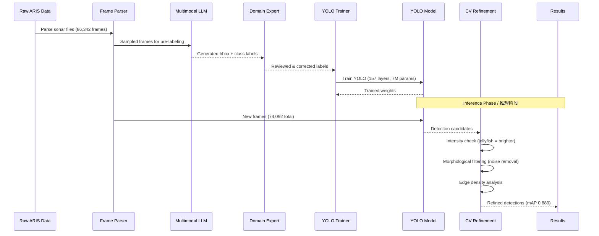

# ARIS Sonar Jellyfish Detection / ARIS 声呐水母检测

## STAR Summary / STAR 概述

### Situation / 背景
ARIS (Adaptive Resolution Imaging Sonar) sonar images present unique challenges for object detection: fuzzy boundaries from beam geometry, dense and overlapping targets, sparse texture information (no optical color), low contrast, multipath artifacts, and extremely high annotation cost — domain expertise is required per frame. Manual annotation of 86,000+ frames was economically prohibitive. Initial experiments with optical CV approaches transferred poorly to acoustic imagery.

ARIS 声呐图像面临独特的目标检测挑战：波束几何导致的边界模糊、目标密集重叠、纹理稀疏（无光学颜色）、低对比度、多径伪影，以及极高的标注成本——每帧都需要领域专家。人工标注 86,000+ 帧在经济上不可行。光学 CV 方法在声学图像上迁移效果差。

### Task / 任务
Build a detection pipeline combining multimodal AI-assisted annotation with YOLO-based detection and traditional computer vision refinement to detect jellyfish in ARIS sonar imagery with drastically reduced human annotation burden while maintaining high detection accuracy.

构建结合多模态 AI 辅助标注、YOLO 检测和传统计算机视觉后处理的检测流水线，大幅降低人工标注负担的同时保持高检测精度。

### Action / 行动

| Step | Action / 行动 | Detail / 详情 |
|---|---|---|
| 1 | Frame parsing / 帧解析 | Parsed 86,342 ARIS frames from raw sonar data. Frame size: 512x96. Generated sonar tensor: (86342, 512, 2) |
| 2 | AI-assisted annotation / AI 辅助标注 | 6-step pipeline: (1) Raw extraction, (2) Pre-filtering (target presence), (3) Multimodal LLM generates bbox+labels, (4) Human review/correction, (5) Quality check (IoU LLM vs human), (6) Dataset expansion via model prediction + human review |
| 3 | YOLO training / YOLO 训练 | 157 layers, 7,012,822 parameters, 15.8 GFLOPs. Trained on AI-label-expanded dataset |
| 4 | Traditional CV refinement / 传统CV后处理 | Intensity-based region check (jellyfish = brighter), morphological filtering for false positives from noise artifacts, edge density analysis |
| 5 | Inference optimization / 推理优化 | Model optimization + preprocessing: 5.6 FPS → 26.7 FPS (4.8x speedup) |

### Result / 结果

| Metric / 指标 | Value / 数值 |
|---|---|
| ARIS frames parsed / 解析帧数 | 86,342 |
| Detection frames processed / 检测帧数 | 74,092 |
| YOLO model layers / 模型层数 | 157 |
| YOLO parameters / 参数数量 | 7,012,822 |
| YOLO GFLOPs / 计算量 | 15.8 |
| mAP (mean Average Precision) | 0.889 |
| Inference speed (baseline) / 基线速度 | 5.6 FPS |
| Inference speed (optimized) / 优化速度 | 26.7 FPS |
| Annotation effort reduction / 标注减负 | ~60-70% |

## Why ARIS Images Are Difficult / 为什么 ARIS 图像困难

| Challenge / 挑战 | Explanation / 解释 |
|---|---|
| No optical color / 无光学色彩 | Only acoustic reflectivity (intensity) available as signal |
| Sparse texture / 纹理稀疏 | Beam geometry produces limited textural detail; traditional CV features (SIFT, HOG) produce sparse results |
| Fuzzy boundaries / 边界模糊 | Point-spread function of sonar beams creates soft edges; exact bounding box placement is inherently ambiguous |
| High noise floor / 高底噪 | Background acoustic noise can produce false-positive structures |
| Dense targets / 目标密集 | Overlapping jellyfish create complex multi-object scenarios |
| Multipath artifacts / 多径伪影 | Acoustic reflections create ghost targets and range ambiguities |

## System Architecture / 系统架构



## Data Flow / 数据流



## Pseudocode: Detection Pipeline / 伪代码

```python
class ARISJellyfishDetector:
    def __init__(self, model_path, conf_threshold=0.5, iou_threshold=0.45):
        self.model = YOLO(model_path)  # 157 layers, 7,012,822 params
        self.conf_threshold = conf_threshold
        self.iou_threshold = iou_threshold
        self.background_threshold = None  # calibrated during init

    def calibrate_background(self, sample_frames):
        """Estimate background intensity from sample frames."""
        intensities = [np.mean(f) for f in sample_frames]
        self.background_threshold = np.percentile(intensities, 30)

    def detect(self, sonar_frame):
        # 1. Preprocessing: normalize
        frame = (sonar_frame - np.min(sonar_frame)) / \
                (np.max(sonar_frame) - np.min(sonar_frame) + 1e-8)

        # 2. YOLO inference
        results = self.model(frame, conf=self.conf_threshold,
                            iou=self.iou_threshold)

        # 3. Traditional CV post-processing
        detections = []
        for box in results.boxes:
            x1, y1, x2, y2 = box.xyxy[0].int().tolist()
            region = frame[y1:y2, x1:x2]

            # 3a. Intensity check: jellyfish have higher acoustic reflectivity
            if np.mean(region) > self.background_threshold:
                # 3b. Edge density check: jellyfish have moderate structure
                edges = cv2.Canny(
                    (region * 255).astype(np.uint8), 50, 150
                )
                edge_density = np.sum(edges > 0) / region.size

                if 0.05 < edge_density < 0.3:
                    # 3c. Boost confidence for likely jellyfish regions
                    box.conf[0] = min(box.conf[0] * 1.1, 1.0)
                    detections.append(box)

        # 4. NMS for dense target scenarios
        detections = non_max_suppression(detections, self.iou_threshold)

        return detections
```

## Annotation Pipeline Design / 标注流水线设计

| Step | Name / 名称 | Description / 描述 |
|---|---|---|
| 1 | Frame Extraction / 帧提取 | Raw file → individual frames |
| 2 | Pre-filtering / 预筛选 | Remove empty/noise-only frames |
| 3 | AI Pre-labeling / AI 预标注 | Multimodal LLM: bbox + class + confidence |
| 4 | Human Review / 人工复核 | Expert corrects AI labels (reduced from full annotation to verification) |
| 5 | Quality Gate / 质量门控 | IoU(AI labels, human corrections) → accept if > 0.7 |
| 6 | Dataset Expansion / 数据扩展 | Train model on reviewed set → predict next batch → human reviews predictions (even faster than reviewing raw AI labels) |

## Evaluation Design / 评估设计

| Level | Focus / 维度 | Metric / 指标 | Target / 目标 |
|---|---|---|---|
| L1 Format | Data integrity | Frames successfully parsed | 100% |
| L2 Numerical | Detection quality | mAP | > 0.85 |
| L2 Numerical | Per-class performance | Precision, Recall, F1 | > 0.85 |
| L3 Domain | Operational speed | FPS | > 20 (real-time) |
| L3 Domain | False positive rate | FP / total detections | < 5% |
| L3 Domain | Annotation efficiency | Time saved vs pure manual | > 50% |

## Project Retrospective / 项目复盘

### What Worked / 有效方法
1. **AI-assisted annotation was the only path**: Pure manual annotation of 86k+ sonar frames was economically impossible. The LLM→human→model→human loop created a virtuous cycle where each round improved the model, reducing annotation effort.
2. **Traditional CV still matters**: Simple intensity and morphology checks eliminated YOLO false positives from noise — a small addition with outsized impact.
3. **Inference optimization unlocked deployment**: 4.8x speedup (5.6 → 26.7 FPS) moved from "research demo" to "deployable product."

### Key Insights / 关键发现
- Sonar images require different assumptions than optical images — texture, color, and boundary clarity assumptions from optical CV don't transfer
- Annotation pipeline design is a UX problem, not just an ML problem
- Bounding box annotation in sonar is inherently fuzzy — IoU thresholds should be relaxed vs optical benchmarks

### Boundaries / 边界
- High-clutter environments: performance degrades with very dense targets
- Very small targets: juvenile jellyfish below ~5 pixels are unreliable
- ARIS-specific: model trained on ARIS imagery; performance on other sonar types untested
- Single species: currently jellyfish-focused; multi-class requires re-annotation

## Role-based Interpretation / 岗位化表达
- **AI App Engineer**: YOLO training pipeline, inference optimization, multimodal LLM integration, annotation tooling
- **AI Algorithm Engineer**: Traditional CV refinement, edge density analysis, NMS optimization
- **AI Product Manager**: Annotation cost reduction framing, pipeline workflow design, human-in-the-loop design
- **AI Solution PM**: Domain challenge identification (sonar vs optical), annotation strategy design
