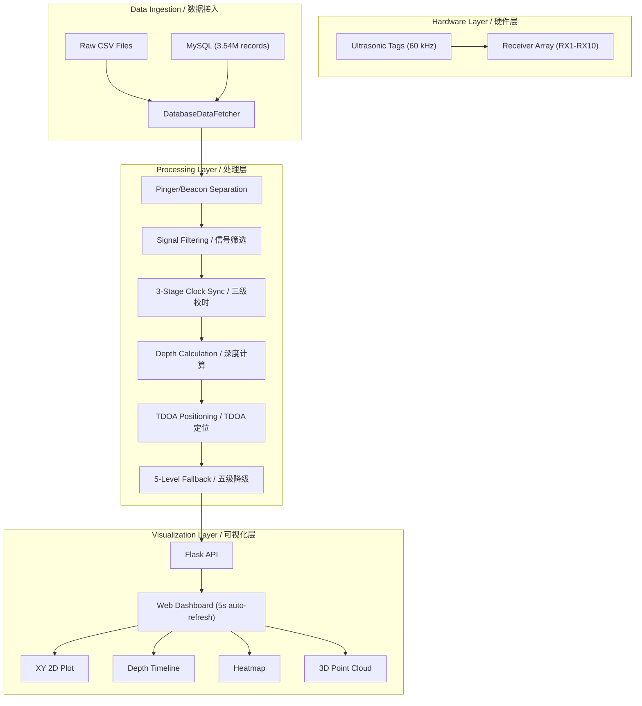
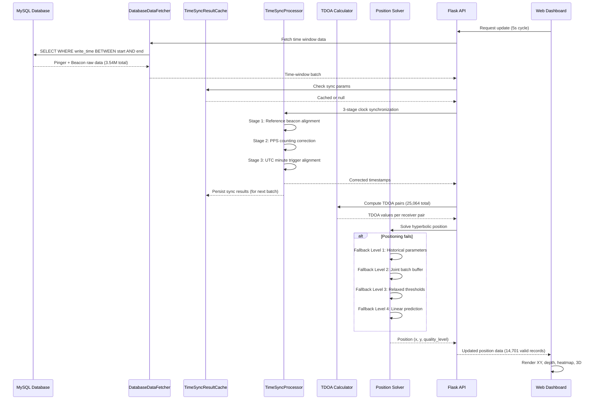

# Ultrasonic Tag Positioning System / 超声波标记定位系统

## STAR Summary / STAR 概述

### Situation / 背景
Ultrasonic tag positioning in real-world underwater environments requires stable integration of hardware, receivers, signal filtering, clock synchronization, positioning algorithms, database storage, and visualization — not just a single algorithm. Field deployments compound the challenge with receiver reboot, data discontinuity, clock drift, multipath interference, and uncertain deployment conditions.

超声波标记定位在真实水下环境中需要硬件、接收机、信号筛选、校时、定位算法、数据库和可视化的稳定集成——不是单一算法问题。野外部署面临接收机重启、数据不连续、时钟漂移、多径干扰和不确定部署条件等挑战。

### Task / 任务
Build an integrated engineering workflow from raw signal acquisition through positioning computation to web-based real-time visualization, handling the full chain: signal decoding, depth calculation, receiver clock synchronization, TDOA positioning, and continuous monitoring with graceful degradation.

构建从原始信号采集到Web实时可视化的集成工程流程，覆盖信号解码、深度计算、接收机校时、TDOA定位和带降级策略的连续监测全链路。

### Action / 行动

| Step | Action / 行动 | Detail / 详情 |
|---|---|---|
| 1 | Signal decoding / 信号解码 | Ultrasonic tags: 60kHz carrier, double-pulse for depth, triple-pulse for depth+temperature. code1/code2 identification, a/b parameters for decoding, period constraints (period_min/period_max) |
| 2 | Data architecture / 数据架构 | PingerRawData/BeaconRawData struct separation, pulse grouping by time, is_pinger flag routing |
| 3 | Multi-layer validation / 多层验证 | Per-pulse validity (must contain origin RX1 + X-axis RX2), per-pinger validity (any one valid pulse), minimum receiver count enforcement |
| 4 | Clock synchronization / 三级校时 | 3-stage: (1) Reference beacon alignment, (2) PPS (Pulse-Per-Second) counting, (3) UTC minute trigger correction. TimeSyncResultCache for result inheritance across batches. Max offset corrected: 129.52s |
| 5 | TDOA positioning / TDOA 定位 | Hyperbolic positioning with least-squares solver, receiver array geometry |
| 6 | Five-level fallback / 五级降级 | Standard → Historical Params → Joint Batch → Relaxed Threshold → Linear Prediction (by biological speed constraint) |
| 7 | Real-time system / 实时系统 | MySQL DB (3.54M records), DatabaseDataFetcher (time-window query), Flask API, Web dashboard (5s auto-refresh) |
| 8 | Visualization / 可视化 | XY 2D (with envelope zone + receiver positions), depth timeline (24h scroll), 2D heatmap, 3D point cloud, pinger multi-select |

### Result / 结果

| Metric / 指标 | Value / 数值 |
|---|---|
| Pulse groups processed / 脉冲组处理 | 4,720 |
| TDOA pairs computed / TDOA 数据对 | 25,064 |
| Valid depth values / 有效深度值 | 21,292 |
| Valid records after filtering / 过滤后有效记录 | 14,701 |
| Tags successfully positioned / 成功定位标签 | 4 |
| Depth range / 深度范围 | 60.09 - 80.07 m |
| Max clock offset corrected / 最大校时纠正 | 129.52 s |
| Database records / 数据库记录 | 3,544,034 |
| Data time span / 数据时间跨度 | ~24 hours (2025-12-07 ~ 2025-12-08) |
| Web refresh cycle / Web 刷新周期 | 5 seconds |

## System Architecture / 系统架构



## Data Flow / 数据流



## Signal Principle / 信号原理

| Parameter / 参数 | Value / 值 | Description / 描述 |
|---|---|---|
| Carrier frequency / 载波频率 | ~60 kHz | Ultrasonic band for underwater propagation |
| Encoding / 编码方式 | Double-pulse / Triple-pulse | Double = depth only, Triple = depth + temperature |
| Identification / 标识 | code1, code2 | Per-tag unique identifiers |
| Decoding params / 解码参数 | a, b | Signal-specific decoding coefficients |
| Period constraints / 周期约束 | period_min, period_max | Valid inter-pulse period range |

## Clock Synchronization / 校时设计

### Three-Stage Synchronization / 三级同步

| Stage | Method / 方法 | Purpose / 目的 |
|---|---|---|
| 1 | Reference Beacon / 参考信标 | Use fixed-location beacon as absolute time reference |
| 2 | PPS Counting / 秒脉冲计数 | Per-second pulse alignment at receiver hardware level |
| 3 | UTC Minute Trigger / UTC 分钟触发 | Align to UTC minute boundary for absolute time |

### Key Components / 关键组件

- **TimeSyncResultCache**: Persists and inherits sync parameters across processing batches, avoiding recalculation for every window
- **Max offset observed**: 129.52 seconds — demonstrates why automated sync is essential (manual correction impractical)
- **Beacon-based correction**: Reference beacon at known position provides ground truth for time offset calculation

## Five-Level Fallback Strategy / 五级降级策略

| Level | Strategy / 策略 | Trigger / 触发 | Min RX | Quality / 质量 |
|---|---|---|---|---|
| 1 | Standard / 标准 | Current batch sync success | >= 3 | HIGH |
| 2 | Historical Params / 历史参数 | Sync failed but cached params exist | >= 3 | MEDIUM |
| 3 | Joint Batch / 联合批处理 | Buffer multiple time batches | >= 2 batches | MEDIUM |
| 4 | Relaxed Threshold / 放宽阈值 | Standard thresholds fail | >= 2 | LOW |
| 5 | Linear Prediction / 线性预测 | All strategies exhausted | N/A | PREDICTED |

## Pseudocode: Processing Orchestrator / 伪代码

```python
class ProcessingOrchestrator:
    """Core processing coordinator for ultrasonic tag positioning."""

    def __init__(self, raw_repo, processed_repo, config_repo):
        self.raw_repo = raw_repo
        self.processed_repo = processed_repo
        self.config_repo = config_repo
        self.sync_cache = TimeSyncResultCache()

    def process_new_data(self):
        # 1. Init: load receiver geometry and reference beacon
        receivers = self.config_repo.get_receivers()
        reference_beacon = self.config_repo.get_reference_beacon()

        # 2. Fetch unprocessed data
        pinger_data = self.raw_repo.get_unprocessed(is_pinger=True)
        beacon_data = self.raw_repo.get_unprocessed(is_pinger=False)

        # 3. Group by pulse window
        pulse_groups = self._group_by_time_window(pinger_data)

        # 4. Multi-layer validation
        valid_pulses = []
        for group in pulse_groups:
            rx_ids = {p.receiver for p in group}
            # Must have origin RX(1) and X-axis RX(2)
            if 1 in rx_ids and 2 in rx_ids:
                if len(rx_ids) >= self.config_repo.min_receivers:
                    valid_pulses.append(group)

        # 5. Process each valid pulse group
        results = []
        for pulse_group in valid_pulses:
            # 5a. Clock sync with fallback
            sync = self._sync_clock(pulse_group, beacon_data, reference_beacon)
            if not sync.success:
                sync = self.sync_cache.get_last_valid()

            # 5b. Depth from signal encoding
            depth = self._decode_depth(pulse_group)

            # 5c. TDOA positioning with 5-level fallback
            position = None
            quality = None
            for level in range(1, 6):
                position, quality = self._try_position(
                    pulse_group, sync, depth, receivers, level
                )
                if position:
                    break

            # 6. Persist results
            self.processed_repo.save_position(position, quality)
            self.processed_repo.save_depth(depth)
            self.raw_repo.mark_processed([p.id for p in pulse_group])
            results.append((position, depth, quality))

        return ProcessingSummary(
            total=len(pulse_groups),
            valid=len(valid_pulses),
            positioned=len([r for r in results if r[0]]),
            quality_distribution=self._count_qualities(results)
        )
```

## Evaluation Design / 评估设计

| Level | Focus / 维度 | Metric / 指标 | Target / 目标 |
|---|---|---|---|
| L1 Format | Data integrity | Schema pass rate, missing value ratio | 100%, <1% |
| L2 Numerical | Sync accuracy | Clock offset residual | < 10 ms |
| L2 Numerical | TDOA quality | TDOA residual RMS | < 1 ms |
| L3 Domain | Trajectory smoothness | Max inter-point jump | < 5 m/s biological speed |
| L3 Domain | Depth plausibility | Depth within expected range | 60-80 m |
| L3 Domain | Visualization | Dashboard refresh | <= 5 seconds |

## Project Retrospective / 项目复盘

### What Worked / 有效方法
1. **Five-level fallback was essential**: Real deployments guaranteed data gaps. The graduated fallback ensured positioning continuity under adverse conditions.
2. **Clock synchronization > solver precision**: A 1m-accurate track with correct clock sync outperformed 10cm snapshots with timing errors.
3. **DDD provided clarity**: Structuring code as ProcessingOrchestrator, PingerRawData, BeaconRawData made domain logic explicit and testable.

### Key Insights / 关键发现
- Field projects require joint **algorithm + hardware co-design**, not sequential handoff
- **Robustness over ideal accuracy**: Data continuity and clock sync correctness are more critical than solver precision
- **Manual verification tools** are safety-critical: automated systems can silently fail in ways only a domain expert detects
- Hardware clock drift accumulation must be monitored and corrected periodically

### Boundaries / 边界
- Tag-type specific: validated for ~60 kHz ultrasonic tag models
- Receiver geometry dependent: positioning accuracy degrades with poor array geometry
- Multipath environments (shallow water, complex bathymetry) degrade signal clarity
- Linear prediction (Level 5) assumes max biological speed of ~5 m/s

## Role-based Interpretation / 岗位化表达

- **AI Algorithm Engineer**: TDOA implementation, clock sync design, multi-layer validation, five-level fallback, DDD architecture
- **AI Application Engineer**: Flask API backend, MySQL integration (3.54M records), Web dashboard (ECharts), real-time data fetching
- **AI Product Manager**: Problem framing (integration, not algorithm), graceful degradation design, user-facing visualization requirements
- **AI Solution PM**: Domain workflow conversion (field processing → digital pipeline), hardware-software co-design thinking
