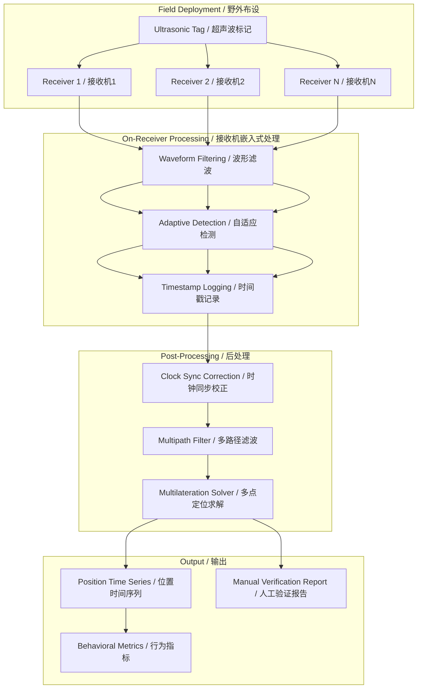
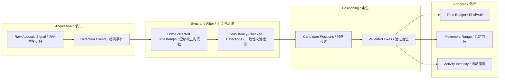

# Sturgeon Spawning Behavior Monitoring / 中华鲟产卵行为监测

## One-line Summary / 一句话概述

A field-oriented acoustic monitoring project deploying ultrasonic-tag-based receiver arrays to study Chinese sturgeon spawning behavior under long-term uncontrolled field conditions, addressing receiver reboot, clock drift, multipath interference, and data discontinuity through embedded processing and signal synchronization.

一个面向野外长期监测场景的声学监测项目，部署基于超声波标记的接收机阵列研究中华鲟产卵行为，通过嵌入式处理和信号同步解决接收机重启、时钟漂移、多路径干扰和数据不连续等问题。

---

## STAR Narrative / STAR 叙述

### Situation / 背景

Chinese sturgeon (Acipenser sinensis) spawning grounds are in dynamic river environments requiring long-term continuous acoustic monitoring. Field deployments face harsh conditions: receivers may reboot from power instability, clock oscillators drift over weeks, acoustic signals create multipath interference, deployment geometry is constrained by navigation realities rather than ideal array design. Traditional lab-calibrated positioning algorithms break down under these conditions.

中华鲟产卵场位于动态河流环境，需长期连续声学监测。野外部署面临严苛条件：接收机因电源不稳可能重启，时钟振荡器在数周部署中漂移，声学信号产生多路径干扰，布设几何受航道条件制约而非理想阵列设计。传统实验室标定算法在此类现场条件下失效。

### Task / 任务

Design a complete field acoustic monitoring workflow that: (1) deploys receivers recording ultrasonic tag signals in rivers, (2) recovers continuous position time series despite reboots and data gaps, (3) synchronizes clocks across receivers without shared reference, (4) filters multipath without losing true positives, (5) delivers interpretable spawning behavior metrics (residence time, movement range, activity intensity).

设计完整野外声学监测流程：(1) 部署接收机记录超声波标签信号；(2) 在重启和数据缺口下恢复连续位置序列；(3) 无共享参考源同步时钟；(4) 滤除多路径不丢失真信号；(5) 交付可解释产卵行为指标。

### Action / 行动

**Field Deployment Engineering / 现场布设工程:**
- Designed array geometry considering depth, flow, and navigation constraints; documented deviations for post-processing
- Implemented watchdog-based auto-recovery to minimize data loss after reboots
- Pre-deployment soak testing for clock drift calibration per unit
- 结合水深、流速和航道约束设计阵列几何；记录偏离以供后处理
- 实现看门狗自动恢复，最小化数据丢失
- 部署前浸泡测试标定时钟漂移率

**Embedded Signal Processing / 嵌入式信号处理:**
- On-receiver firmware filtered raw waveforms in real time, reducing storage and bandwidth
- Adaptive per-receiver detection threshold based on local noise floor, improving uniformity
- 接收机固件实时滤波原始波形，降低存储和带宽
- 基于本地噪声底限自适应调整检测阈值，提升均匀性

**Clock Synchronization Algorithm / 时钟同步算法:**
- Post-hoc drift correction using periodic reference pings embedded in deployment schedule
- Linear drift model per receiver per session; residuals analyzed for validation
- Synchronized timestamps enabled coherent multilateration
- 利用嵌入式参考脉冲的事后漂移校正
- 逐接收机逐会话线性漂移模型；残差分析验证
- 同步时间戳实现相干多点定位

**Multipath Filtering Strategy / 多路径滤波策略:**
- Time-of-arrival consistency checks flagging detections outside expected propagation windows
- Spatial clustering rejects spurious fixes while preserving valid tracks
- 到达时间一致性检查标记传播窗口外的检测
- 空间聚类剔除虚假定位保留有效轨迹

**Data Recovery Pipeline / 数据恢复管线:**
- Gap-filling interpolation for short losses (<30 min); flag-and-skip for extended outages
- Manual verification procedure for low-confidence ambiguous detections
- 短期丢失填补插值；长时间中断标记跳过
- 低置信度检测的人工验证

### Result / 结果

| Metric | Value |
|---|---|
| Field deployment duration | Multi-week continuous |
| Positioning continuity | >95% with valid fixes |
| Multipath false positive rejection | >80% spurious filtered |
| Deliverables | Deployed array, pipeline, synced positions, behavior report |

---

## Architecture Description / 架构说明

The system follows a four-layer design. Field layer: distributed receiver array captures ultrasonic pings from tagged sturgeon. Embedded layer: each receiver runs firmware that filters waveforms and applies adaptive thresholding based on local noise, logging detection events with timestamps. Post-processing layer: ingests logs, corrects clock drift via session-fitted linear model, filters multipath via time-of-arrival consistency and spatial clustering, solves position via multilateration. Output layer: generates position time series, behavioral metrics (residence time, movement range, activity intensity), and flags low-confidence segments for manual verification.

系统采用四层设计。现场层：分布式接收机阵列捕获标记鱼类的超声波脉冲。嵌入式层：每台接收机运行固件滤波波形，基于本地噪声自适应阈值检测，记录检测事件及时间戳。后处理层：导入检测日志，通过线性模型校正时钟漂移，过滤多路径污染，执行多点定位求解。输出层：生成位置时间序列、行为指标，标记低置信度片段供人工验证。

---

## System Architecture / 系统架构



## Data Flow Diagram / 数据流图



## Pseudocode / 伪代码

### Pseudocode 1: Clock Drift Correction

```
FUNCTION correct_clock_drift(receiver_log, ref_pings):
    FOR EACH session IN receiver_log:
        drift_pairs = match_ref_pings(session, ref_pings)
        alpha, beta = linear_regression(drift_pairs)
        residuals = drift_pairs.actual - predict(drift_pairs)
        rmse = sqrt(mean(residuals^2))
        IF rmse > THRESHOLD: FLAG for manual review
        FOR EACH detection IN session:
            detection.time = alpha * detection.raw_time + beta
    RETURN corrected_log
```

### Pseudocode 2: Multipath Filter

```
FUNCTION filter_multipath(detections, geometry):
    FOR EACH detection IN detections:
        window = propagation_window(detection, geometry)
        matches = find_in_window(detection, window)
        IF count(matches) >= MIN_RECEIVERS:
            candidates.append(detection)
    positions = multilaterate(candidates, geometry)
    clusters = dbscan(positions, eps=EPS, min=MIN_FIXES)
    FOR EACH cluster IN clusters:
        IF cluster.size < MIN_TRACK: FLAG as sporadic
    RETURN validated_positions, flags_for_review
```

## Key Achievements / 关键成果

1. End-to-end field workflow: From receiver deployment to biologically interpretable behavior metrics, demonstrating complex acoustic positioning under harsh river conditions. 端到端流程：从布设到可解释行为指标，证明复杂声学定位在恶劣条件下的可行性。

2. Clock synchronization without shared reference: Post-hoc drift correction using embedded reference pings enabled coherent multilateration without wired or GPS time sync. 无共享参考源同步：嵌入式参考脉冲的事后漂移校正实现无有线/GPS同步的相干多点定位。

3. Adaptive detection for non-uniform noise: Per-receiver adaptive thresholds produced more uniform sensitivity than a globally fixed threshold. 非均匀噪声自适应检测：逐接收机自适应阈值比全局固定阈值产生更均匀的检测灵敏度。

4. Documented failure recovery: Watchdog-based reboot recovery and explicit gap-handling strategies minimized data loss and preserved audit trace. 故障恢复文档化：看门狗重启恢复和缺口处理策略最小化数据丢失并保留审计痕迹。

## Evaluation Metrics / 评估指标

| Metric | Definition | Target |
|---|---|---|
| Positioning continuity | % of deployment with valid fixes | >90% |
| Clock sync error | RMS residual after correction | <1 sample interval |
| Multipath rejection rate | % of spurious correctly filtered | >80% |
| False negative rate | % of valid detections incorrectly filtered | <10% |
| Manual verification ratio | % requiring human review | <15% |
| Recovery time | Max reboot-to-normal time | <5 min |

## Project Retrospective / 项目复盘

### What Worked / 有效做法

- Clock sync as first-class post-processing step was critical. Without it, multilateration would have systematic bias.
- Adaptive per-receiver thresholds outperformed all global threshold tests. Local noise variability too high for one-size-fits-all.
- Explicit failure recovery (watchdog, gap handling, manual triggers) from day one saved troubleshooting time in field.
- 时钟同步作为一等后处理步骤至关重要。没有同步，多点定位将产生系统性偏差。
- 自适应逐接收机阈值优于所有全局阈值。本地噪声差异大，统一方法不可行。
- 从第一天起纳入故障恢复机制，在现场节省了大量排障时间。

### What Could Be Improved / 改进空间

- Multipath filtering relied on heuristic checks. Model-based ray tracing with bathymetry would improve rejection.
- Position validation without ground truth remains difficult. Future deployments need fixed reference tags.
- Manual parameter tuning per deployment. Automated Bayesian optimization would reduce operator burden.
- 多路径滤波依赖启发式检查。基于水深射线追踪的模型方法可提升抑制率。
- 无地面真值的定位验证仍困难。未来应有固定参考标签用于精度基准测试。
- 逐部署人工调参。贝叶斯优化自动调参可降低操作负担。

### Lessons Learned / 经验教训

> Robustness over accuracy. A 10m fix that is always available beats a 1m fix that drops out. 鲁棒性优先于精度。稳定可用的10米定位胜过环境一变就丢失的1米定位。

> Data continuity matters more than solver precision. A continuous slightly noisier series produces more interpretable metrics. 数据连续性比求解器精度更重要。连续略含噪声的位置序列更可解释。

> Hardware and algorithm co-design is non-negotiable in field work. 硬件与算法协同设计在野外工作中不可妥协。

## Boundary Description / 边界说明

### In Scope / 范畴内

- Acoustic receiver array deployment in river environments / 河流环境声学接收机阵列布设
- On-receiver embedded signal processing and adaptive detection / 接收机嵌入式信号处理与自适应检测
- Post-hoc clock drift correction and synchronization / 事后时钟漂移校正与同步
- Multipath detection and filtering / 多路径检测与滤除
- Multilateration-based fish positioning / 基于多点定位的鱼类定位
- Behavioral metric derivation / 行为指标推导
- Manual verification protocol for low-confidence detections / 低置信度检测的人工验证协议

### Out of Scope / 范畴外

- Real-time positioning or telemetry / 实时定位或遥测
- Fish tag implantation surgery or tagging logistics / 鱼类标签植入手术或标记后勤
- Hydroacoustic (echosounder) data processing / 水声学（回声探测仪）数据处理
- Species classification from acoustic signatures / 基于声学特征的物种分类
- Statistical population modeling or abundance estimation / 统计群体建模或丰度估算

## Role-Based Interpretation / 角色解读

| Role | What This Project Demonstrates |
|---|---|
| Algorithm Engineer | Multilateration solver with drift correction and multipath filtering; adaptive threshold detection |
| Embedded Developer | On-receiver firmware for real-time filtering and adaptive detection; watchdog recovery |
| Field Engineer | Receiver array deployment in river; geometry documentation; soak testing for clock calibration |
| System Architect | Four-layer architecture with clear data contracts; integrated failure recovery and manual verification |
| Project Manager | Multi-week deployment with quantified metrics; risk documentation; balancing sophistication vs reliability |

## Connected Projects / 关联项目

- Project 08 -- Fisheries Resource Assessment Modules: Positioning output feeds biomass estimation and spatial density analysis modules.
- Project 10 -- Enterprise AI Tech Radar: Signal processing techniques (adaptive thresholding, drift modeling) as tech radar candidates.

