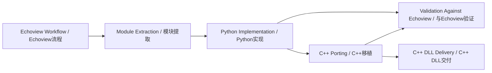

# Fisheries Resource Assessment Algorithm Modules / 渔业资源评估算法模块

## One-line Summary / 一句话概述

A set of acoustic data-processing modules for fisheries resource assessment, benchmarked against Echoview-style workflows and delivered as reusable Python/C++ modules for software integration.

一组面向渔业资源评估的声学数据处理模块，以 Echoview 风格流程为验证参考，交付为可复用的 Python/C++ 模块用于软件集成。

---

## STAR Narrative / STAR 叙述

### Situation / 背景

Scientific acoustic fisheries assessment relies on specialized software like Echoview for data processing, but workflows in Echoview are largely manual, proprietary, and not designed for automated pipeline execution. Engineering teams need to integrate validated acoustic processing into larger software systems, but Echoview cannot be embedded or scripted at scale. The gap between scientific validation (done in Echoview) and engineering delivery (needing standalone modules) creates a translation bottleneck.

科学声学渔业评估依赖 Echoview 等专业软件进行数据处理，但 Echoview 流程多为手动操作、专有格式，不适合自动化管线执行。工程团队需将验证过的声学处理集成到更大的软件系统中，但 Echoview 无法大规模嵌入或脚本化。科学验证（Echoview 中完成）与工程交付（需要独立模块）之间的鸿沟造成了转换瓶颈。

### Task / 任务

Extract 11 core algorithm modules from Echoview-based acoustic processing workflows and re-implement them as standalone, validated Python/C++ modules. Each module must: (1) have a clearly defined input/output contract matching Echoview semantics, (2) produce results within tolerance when compared against Echoview reference output at cell, ping, and region levels, and (3) be packaged for C++ DLL integration into downstream software.

从 Echoview 声学处理流程中提取 11 个核心算法模块，重新实现为独立的、经过验证的 Python/C++ 模块。每个模块必须：(1) 有明确的输入/输出契约，匹配 Echoview 语义；(2) 在单元格、ping 和区域级别与 Echoview 参考输出的对比中，结果在容差范围内；(3) 打包为 C++ DLL 供下游软件集成。

### Action / 行动

**Module Extraction and Contract Definition / 模块提取与契约定义:**
- Analyzed Echoview data flow to identify 11 discrete algorithm boundaries: raw data parsing, Echoview CSV parsing, Sv processing, noise removal, bottom detection, surface detection, single target detection, NASC calculation, target bitmap, ping merging, biomass estimation
- Defined precise input/output contracts for each module, specifying data types, dimensions, units, and acceptable tolerances

- 分析 Echoview 数据流，识别出 11 个离散的算法边界
- 为每个模块定义精确的输入/输出契约，指定数据类型、维度、单位和可接受容差

**Implementation / 实现:**
- Implemented each module first in Python for rapid prototyping and validation
- Ported critical modules (Sv processing, NASC, noise removal) to C++ for performance
- C++ modules packaged as DLLs with C-compatible interface for language-agnostic integration

- 先用 Python 实现每个模块以快速原型设计和验证
- 将关键模块（Sv 处理、NASC、噪声去除）移植到 C++ 以获得性能
- C++ 模块打包为 DLL，提供 C 兼容接口以实现语言无关集成

**Validation Methodology / 验证方法:**
- Cell-level comparison: per-cell Sv values against Echoview reference
- Ping-level comparison: integrated metrics per ping against Echoview reference
- Region-level integration: NASC and biomass within user-defined regions against Echoview reference
- Tolerance-based validation with pass/fail criteria per module

- 单元格级对比：逐单元格 Sv 值与 Echoview 参考值对比
- Ping 级对比：逐 ping 积分指标与 Echoview 参考值对比
- 区域级积分：用户定义区域内的 NASC 和生物量与 Echoview 参考值对比
- 基于容差的验证，每个模块有通过/失败标准

### Result / 结果

| Metric | Value |
|---|---|
| Candidate modules identified | 11 |
| Implemented Python modules | 11 |
| Ported to C++ DLL | 4-6 critical modules |
| Validation levels | Cell, ping, region |
| Output formats | CSV, figures, summary reports, DLL interface |
| Delivery target | Downstream software integration |

---
## Data Flow / 数据流



## Algorithm Modules / 算法模块

| # | Module | Input | Output | Notes |
|---|---|---|---|---|
| 1 | Raw data parsing | Binary echosounder files | Parsed ping structure | Format-specific |
| 2 | Echoview CSV parsing | Echoview export CSV | Internal data frame | Interop layer |
| 3 | Sv processing | Raw power, calibration params | Volume backscattering (Sv) | Core algorithm |
| 4 | Noise removal | Sv data, noise params | Cleaned Sv | Stationary + transient |
| 5 | Bottom detection | Sv data | Bottom line | Max Sv + tracking |
| 6 | Surface detection | Sv data | Surface line | Near-field exclusion |
| 7 | Single target detection | Sv data, criteria | Single target echoes | Split-beam |
| 8 | NASC calculation | Sv, region mask | Nautical area scattering | Core aggregation |
| 9 | Target bitmap | Single targets | 2D target distribution | Visualization |
| 10 | Ping merging | Multiple pings | Merged ping | Averaging strategy |
| 11 | Biomass estimation | NASC, TS distribution | Biomass density | Scaling by target strength |

## Pseudocode / 伪代码

### Pseudocode 1: Sv Calculation

```
FUNCTION calc_sv(raw_power, calibration_params, range_samples):
    # Convert raw power to volume backscattering strength
    FOR EACH ping IN raw_power:
        FOR EACH sample IN ping:
            # Apply sonar equation: Sv = EL - SL + 2*alpha*R + 10*log10(R^2) - C
            el = raw_power[ping][sample]
            r = range_samples[sample]
            absorption = 2 * calibration.alpha * r
            spreading = 10 * log10(r^2)
            sv = el - calibration.sl + absorption + spreading - calibration.constant
            sv_data[ping][sample] = sv
    # Apply threshold if specified
    IF threshold IS NOT None:
        sv_data[sv_data < threshold] = NaN
    RETURN sv_data
```

### Pseudocode 2: NASC Aggregation

```
FUNCTION calc_nasc(sv_data, region_mask, ping_spacing):
    # Compute nautical area scattering coefficient
    FOR EACH region IN region_mask:
        region_sv = sv_data[region_mask == region.id]
        mean_sv = linear_mean(10^(region_sv / 10))
        # Integrate over depth
        depth_integral = sum(mean_sv) * sample_thickness
        # Scale to nautical mile
        nasc = depth_integral * (1852 / ping_spacing)
        nasc_results[region.id] = nasc
    RETURN nasc_results
```

## Validation Methodology / 验证方法

### Benchmark / 基准

Echoview output is the reference standard. Each module is validated against Echoview results using the same input data.

### Comparison Levels / 对比层级

1. Cell-level comparison: Per-sample Sv values compared element-wise. Tolerance: +-1 dB for Sv, +-5% for NASC.
2. Ping-level comparison: Per-ping integrated metrics (mean Sv, NASC per ping). Tolerance: +-3% for integrated values.
3. Region-level integration: NASC and biomass within user-defined regions. Tolerance: +-2% for region totals.

### Validation Outputs / 验证输出

- CSV comparison tables with delta values per cell/ping/region
- Diagnostic figures showing overlay of Echoview vs module output
- Pass/fail summary report per module per test case
- C++ DLL integration test results

## Evaluation Metrics / 评估指标

| Metric | Definition | Target |
|---|---|---|
| Sv cell accuracy | Mean absolute error vs Echoview | <1 dB |
| NASC region accuracy | Relative error vs Echoview | <5% |
| Processing throughput | Pings processed per second | >1000 pings/sec (C++) |
| Module coverage | Pct of Echoview workflow covered | 100% (11/11 modules) |
| DLL interface compatibility | Pct of API calls passing integration tests | 100% |

## Project Retrospective / 项目复盘

### What Worked / 有效做法

- Clear module boundaries with input/output contracts prevented scope creep. Each module had a single responsibility.
- Python-first prototyping allowed rapid iteration on algorithm correctness before C++ optimization.
- Cell/ping/region hierarchical validation caught errors at the right granularity: cell-level for algorithm bugs, region-level for integration issues.
- 明确的模块边界和输入/输出契约防止了范围蔓延。每个模块职责单一。
- Python 优先原型设计允许在 C++ 优化前快速迭代算法正确性。
- 层级化验证（单元格/ping/区域）在合适的粒度捕获错误。

### What Could Be Improved / 改进空间

- Tolerance thresholds were initially too tight, causing many false validation failures. Adaptive tolerance based on noise conditions would be better.
- C++ porting was done per-module without a shared utility library, leading to code duplication. A refactored common math library would reduce maintenance.
- Validation test data covered only 2-3 echosounder models. Expanding to more models would increase confidence.
- 初始容差阈值过紧导致大量误报。基于噪声条件的自适应容差更好。
- C++ 移植按模块独立进行，缺少共享工具库导致代码重复。重构公共数学库可减少维护。
- 验证测试数据仅覆盖 2-3 种回声探测仪型号。扩展到更多型号可提升信心。

## Boundary Description / 边界说明

### In Scope / 范畴内

- Echoview-compatible acoustic data processing algorithms / 兼容 Echoview 的声学数据处理算法
- Python reference implementation for all 11 modules / 所有11个模块的 Python 参考实现
- C++ DLL for performance-critical modules / 性能关键模块的 C++ DLL
- Cell/ping/region validation against Echoview / 与 Echoview 的层级化验证
- CSV and figure output for validation diagnostics / CSV 和图表验证诊断输出

### Out of Scope / 范畴外

- Real-time processing or streaming data / 实时处理或流式数据
- GUI or interactive visualization / GUI 或交互式可视化
- Database integration or data management / 数据库集成或数据管理
- Acoustic signal acquisition or hardware control / 声学信号采集或硬件控制
- Machine learning or AI-based analysis / 机器学习或基于 AI 的分析

## Role-Based Interpretation / 角色解读

| Role | What This Project Demonstrates |
|---|---|
| Algorithm Engineer | Implemented Sv, NASC, noise removal, and detection algorithms matching Echoview semantics |
| Software Engineer | Python-to-C++ porting with DLL packaging; maintainable module architecture with clear contracts |
| Validation Engineer | Multi-level validation framework (cell/ping/region); tolerance-based pass/fail criteria |
| System Architect | Module decomposition from monolithic Echoview workflow; interface design for downstream integration |
| Project Manager | Delivered 11 modules with quantified accuracy metrics; balanced effort between Python prototyping and C++ delivery |

## Connected Projects / 关联项目

- Project 07 -- Sturgeon Spawning Behavior Monitoring: Positioning output from P07 can serve as input for spatial density and biomass modules here.
- Project 10 -- Enterprise AI Tech Radar: Algorithm techniques (noise removal, TS estimation) are candidates for tech radar evaluation.

