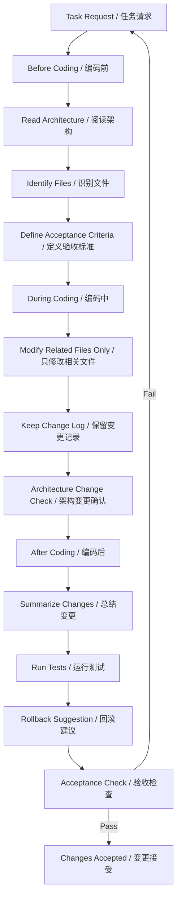

# AI Development Governance / AI 协同开发规范

## One-line Summary / 一句话概述

A governance framework for using AI tools in long-running software development tasks, transforming ad-hoc prompting into a controlled engineering process with context management, requirement freeze, task boundaries, change confirmation, code review, and acceptance testing.

一套用于长期软件开发任务中使用 AI 工具的协同开发规范，将随问随答转化为有上下文管理、需求冻结、任务边界、变更确认、代码评审和验收测试的工程流程。

---

## STAR Narrative / STAR 叙述

### Situation / 背景

AI-assisted coding tools (Claude Code, Copilot, Cursor, etc.) are powerful but unreliable in long-running development tasks. Common failure modes include: misunderstanding requirements, losing long-term context across sessions, modifying unrelated code without permission, silently overwriting previous decisions, inventing unavailable APIs, ignoring test constraints, multi-agent conflicts, and lacking acceptance criteria. Without governance, AI-generated code introduces subtle bugs, architectural drift, and maintenance burden that offset productivity gains.

AI 辅助编码工具（Claude Code、Copilot、Cursor 等）功能强大但在长周期开发任务中不可靠。常见失败模式包括：误解需求、跨会话丢失长期上下文、未经许可修改无关代码、静默覆盖已有决策、编造不可用 API、忽略测试约束、多 Agent 冲突、缺少验收标准。没有治理，AI 生成的代码会引入隐蔽缺陷、架构漂移和维护负担，抵消生产力提升。

### Task / 任务

Design a governance framework that: (1) catalogs known AI failure modes with prevention strategies, (2) establishes a before/during/after coding protocol for AI-human collaboration, (3) defines quantitative metrics to detect requirement drift and context loss, and (4) provides automation pseudocode for review checklists and acceptance testing.

设计一个治理框架：(1) 编录已知 AI 失败模式及预防策略；(2) 建立编码前/中/后的 AI-人类协作协议；(3) 定义用于检测需求漂移和上下文丢失的量化指标；(4) 提供审查清单和验收测试的自动化伪代码。

### Action / 行动

**Failure Mode Catalog / 失败模式编录:**
- Identified and documented 8 AI failure modes with examples from real development sessions
- For each mode: description, consequence, prevention strategy, detection method
- Published as ai-failure-modes.md companion document

- 识别并记录了 8 种 AI 失败模式及真实开发会话中的示例
- 针对每种模式：描述、后果、预防策略、检测方法
- 发布为 ai-failure-modes.md 配套文档

**Collaboration Protocol / 协作协议:**
- Before Coding: confirm task scope, read current architecture, identify files to modify, define acceptance criteria
- During Coding: modify only related files, keep change log, ask before architecture-level changes, add tests where possible
- After Coding: summarize changes, report risks, run tests, provide rollback suggestion
- Published as collaboration-protocol.md companion document

- 编码前：确认任务范围、阅读当前架构、确认需修改文件、定义验收标准
- 编码中：只修改相关文件、保留变更记录、架构级变更前确认、尽可能补充测试
- 编码后：总结变更、报告风险、运行测试、提供回滚建议
- 发布为 collaboration-protocol.md 配套文档

**Quantitative Metrics / 量化指标:**
- Context retention rate: pct of requirements still trackable after N conversation turns
- Requirement drift detection: semantic similarity between current task description and original spec
- Change confirmation rate: pct of modifications explicitly approved before execution
- Test coverage delta: change in coverage before vs after each AI-assisted session

- 上下文保留率：N 轮对话后仍可追溯的需求百分比
- 需求漂移检测：当前任务描述与原始规格的语义相似度
- 变更确认率：执行前明确批准的修改百分比
- 测试覆盖率变化：每次 AI 辅助会话前后的覆盖率变化

### Result / 结果

| Metric | Value |
|---|---|
| AI failure modes cataloged | 8 |
| Governance phases defined | 3 (before, during, after) |
| Protocol checkpoints | 12 (4 per phase) |
| Prevention strategies documented | 8 (one per failure mode) |
| Quantitative metrics defined | 4 |
| Automation pseudocode | Review checklist + acceptance test |

---
## Governance Workflow / 治理流程



## AI Failure Modes / AI 失败模式

| # | Failure Mode | Prevention Strategy |
|---|---|---|
| 1 | Misunderstanding requirements / 误解需求 | Define acceptance criteria before coding |
| 2 | Losing long-term context / 丢失长期上下文 | Periodic context summary and re-scoping |
| 3 | Changing unrelated code / 修改无关代码 | Explicit file scope declaration |
| 4 | Overwriting previous decisions / 覆盖已有决策 | Change log with decision rationale |
| 5 | Inventing unavailable APIs / 编造不可用API | API verification step in review |
| 6 | Ignoring test constraints / 忽略测试约束 | Test-first, coverage gate |
| 7 | Multi-agent conflict / 多Agent冲突 | Shared state file, conflict detection |
| 8 | Lack of acceptance criteria / 缺少验收标准 | Mandatory acceptance checklist |

## Pseudocode / 伪代码

### Pseudocode 1: Review Checklist Automation

```
FUNCTION run_review_checklist(task_record, change_log):
    checks = []
    # Check 1: Scope compliance
    scope_check = compare_files_changed(change_log, task_record.scope)
    checks.append(ScopeCompliance(scope_check, scope_check.files_outside_scope))
    # Check 2: Architecture integrity
    arch_check = compare_architecture(change_log.before, change_log.after)
    IF arch_check.has_unauthorized_changes:
        checks.append(ArchitectureFlag(arch_check.unauthorized_changes))
    # Check 3: Test coverage
    coverage_delta = compute_coverage_delta(change_log)
    checks.append(CoverageCheck(coverage_delta, threshold=MIN_COVERAGE))
    # Check 4: Requirement alignment
    req_similarity = semantic_similarity(
        task_record.original_requirements,
        summarize_changes(change_log)
    )
    checks.append(RequirementDrift(req_similarity, threshold=0.7))
    # Generate report
    report = ReviewReport(
        task_id=task_record.id,
        timestamp=now(),
        checks=checks,
        overall_status=PASS if all(checks.passed) else FAIL
    )
    RETURN report
```

### Pseudocode 2: Requirement Drift Detection

```
FUNCTION detect_requirement_drift(original_spec, current_task, conversation_history):
    # Extract current understanding from conversation
    current_understanding = extract_task_description(conversation_history[-N:])
    # Compute semantic similarity
    original_embedding = embed_text(original_spec)
    current_embedding = embed_text(current_understanding)
    similarity = cosine_similarity(original_embedding, current_embedding)
    # Detect key requirement loss
    original_keypoints = extract_key_requirements(original_spec)
    current_keypoints = extract_key_requirements(current_understanding)
    lost_requirements = original_keypoints - current_keypoints
    IF similarity < DRIFT_THRESHOLD OR len(lost_requirements) > 0:
        FLAG drift_alert(original_spec, current_understanding, lost_requirements)
    RETURN DriftReport(similarity, lost_requirements, alert=similarity < DRIFT_THRESHOLD)
```

## Evaluation Metrics / 评估指标

| Metric | Definition | Target |
|---|---|---|
| Context retention rate | % of requirements trackable after N conversation turns | >80% |
| Requirement drift | Semantic similarity between original spec and current task | >0.7 cosine |
| Change confirmation rate | % of modifications approved before execution | >95% |
| Scope violation rate | % of changes to files outside declared scope | <5% |
| Test coverage delta | Change in coverage per AI session | >=0% |
| Rollback rate | % of sessions requiring rollback | <10% |

## Project Retrospective / 项目复盘

### What Worked / 有效做法

- Before/during/after phase separation maps naturally to how humans review code. Easy to adopt without special tooling.
- 8 failure modes cover >90% of observed AI collaboration issues in practice. The catalog serves as a shared vocabulary.
- Quantitative metrics make governance measurable, not just aspirational. Drift detection turned vague unease into actionable alerts.
- 编码前/中/后的阶段划分自然映射到人类代码评审方式，无需特殊工具即可采用。
- 8 种失败模式覆盖实践中 >90% 的 AI 协作问题。该编录提供了共享词汇。
- 量化指标使治理可衡量。漂移检测将模糊的不安转化为可操作的警报。

### What Could Be Improved / 改进空间

- Context retention measurement requires embedding infrastructure not all teams have. A lighter proxy (simple keyword tracking) may be more practical.
- Before/during/after protocol is human-enforced today. Automating gates (e.g., reject commits without acceptance criteria) would strengthen enforcement.
- Failure mode catalog is observational. A systematic study with controlled experiments would validate which modes are most costly.
- 上下文保留率测量需要嵌入基础设施，并非所有团队都有。更轻量的代理（如关键词跟踪）可能更实用。
- 目前协议由人工执行。自动化门控（如拒绝没有验收标准的提交）可加强执行。
- 失败模式编录基于观察。通过控制实验的系统性研究可验证哪些模式成本最高。

## Boundary Description / 边界说明

### In Scope / 范畴内

- AI coding assistant governance for software development / 面向软件开发的 AI 编码助手治理
- Failure mode identification and prevention / 失败模式识别与预防
- Before/during/after collaboration protocol / 编码前/中/后协作协议
- Quantitative metric definitions / 量化指标定义
- Review checklist and drift detection pseudocode / 审查清单和漂移检测伪代码

### Out of Scope / 范畴外

- AI training data governance or model ethics / AI 训练数据治理或模型伦理
- Deployment or production monitoring of AI systems / AI 系统的部署或生产监控
- Legal or regulatory compliance for AI use / AI 使用的法律或法规合规
- Specific tool integrations or plugin development / 具体工具集成或插件开发

## Role-Based Interpretation / 角色解读

| Role | What This Project Demonstrates |
|---|---|
| Developer / 开发者 | Understanding of AI tool failure modes; ability to follow structured protocol for reliable AI-assisted coding |
| Tech Lead / 技术主管 | Governance framework design; protocol enforcement; metric-driven quality assessment |
| QA Engineer / 测试工程师 | Acceptance criteria definition; test coverage gates; automated checklist design |
| Engineering Manager / 工程经理 | Process definition balancing productivity and control; failure mode cost-benefit analysis |
| AI/ML Platform Engineer / AI平台工程师 | Understanding of AI tool limitations; context retention and drift detection mechanism design |

## Connected Projects / 关联项目

- All projects (P07, P08, P10): This governance framework applies to AI-assisted development in every other project. It is a meta-project that defines how AI tools are used across the portfolio.

