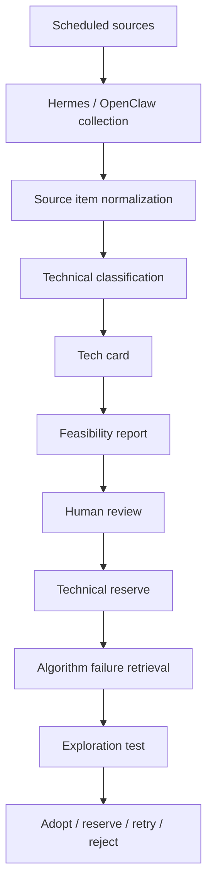

# Enterprise AI Tech Radar

## One-line Summary

A scheduled technology-reserve workflow that collects AI/acoustic research, structures it into reviewable technical cards, and feeds useful techniques back into algorithm development.

## Core Problem

Fast-moving AI and acoustic technologies are easy to collect but hard to use. Without a structured reserve, new papers and repositories remain scattered notes and cannot help real engineering decisions.

## Workflow

## Stored Objects

| Object | Purpose |
|---|---|
| `source_items` | Raw normalized evidence from papers, repositories, manuals, forums, and internal notes |
| `tech_cards` | Decision-ready structured cards with scenario fit, maturity, evidence strength, requirements, and risks |
| `feasibility_reports` | Experiment-facing reports with validation plans, expected effort, integration risk, and recommendation |
| `review_tasks` | Human review queue for uncertain or high-impact decisions |

## Metrics

| Metric | Formula |
|---|---|
| Daily valid item count | accepted source items per scheduled run |
| Duplicate rate | `duplicate_items / collected_items` |
| Extraction completeness | `filled_required_fields / required_fields` |
| Review acceptance rate | `accepted_cards / reviewed_cards` |
| Retrieval precision@K | `relevant_candidates_in_top_k / k` |
| Experiment conversion rate | `experiments_started / retrieved_candidates` |
| Technique win rate | `accepted_techniques / tested_techniques` |
| Failure recovery latency | `report_time - failure_detected_time` |

## Current Status

Architecture and measurement design are complete. The project is presented as a technology-reserve and decision-workflow design, not as a mature production intelligence platform.