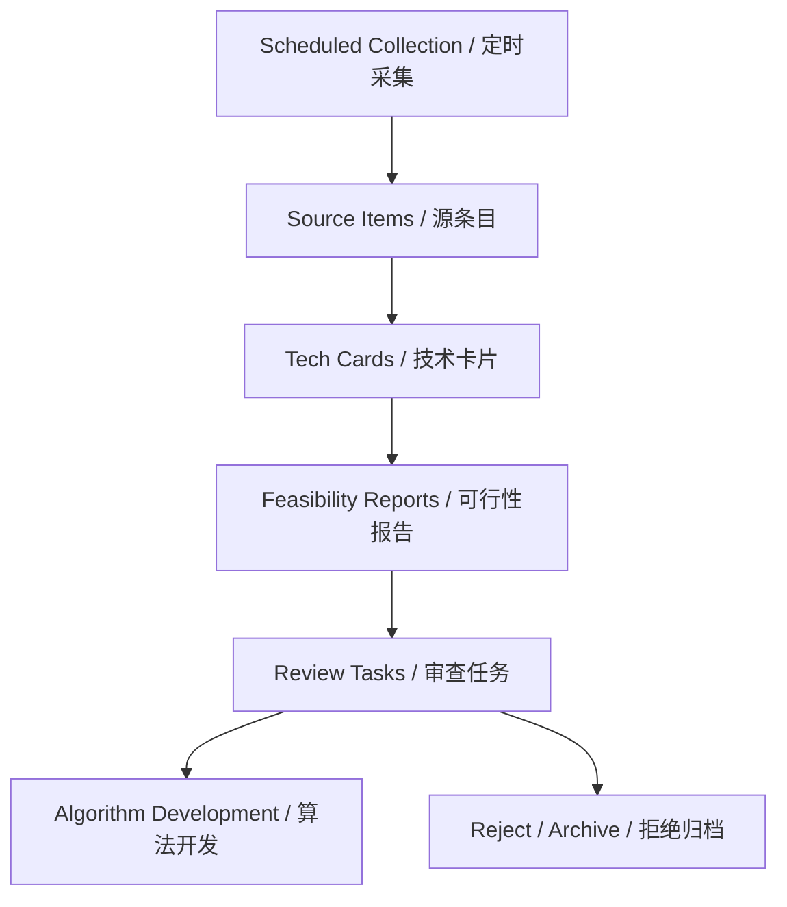

# Enterprise AI Tech Radar / 企业AI技术雷达

## One-line Summary / 一句话概述

A scheduled technology-reserve workflow that collects AI/acoustic research, structures it into reviewable technical cards, and feeds useful techniques back into algorithm development through a weighted scoring model and decision rules.

一个定时运行的技术储备工作流，收集 AI/声学研究，将其结构化可审查的技术卡片，并通过加权评分模型和决策规则将有用技术反馈到算法开发中。

---

## STAR Narrative / STAR 叙述

### Situation / 背景

AI and acoustic signal processing technologies advance rapidly, with hundreds of papers, repositories, and tools released monthly. Development teams struggle to keep up: interesting techniques are collected as bookmarks or scattered notes, but rarely translated into engineering decisions. Without a structured reserve system, promising methods are overlooked, effort is wasted re-exploring dead ends, and technology choices are made based on recency rather than systematic evaluation.

AI 和声学信号处理技术发展迅速，每月有数百篇论文、代码库和工具发布。开发团队难以跟上：有趣的技术被收藏为书签或散落笔记，但很少转化为工程决策。没有结构化的储备系统，有前景的方法被忽视，精力浪费在重新探索死胡同上，技术选择基于时效而非系统评估。

### Task / 任务

Build an automated technology intelligence system that: (1) periodically collects technology signals from scheduled sources (papers, repositories, forums, internal notes), (2) normalizes them into structured source items, (3) evaluates each technique across 7 dimensions using a weighted scoring model, (4) applies decision rules to route techniques to experiment, reserve, review, or reject, and (5) feeds accepted techniques into algorithm development backlog.

构建自动化技术情报系统：(1) 定期从定时源（论文、代码库、论坛、内部笔记）收集技术信号；(2) 标准化为结构化源条目；(3) 使用加权评分模型从 7 个维度评估每项技术；(4) 应用决策规则将技术路由到实验、储备、审查或拒绝；(5) 将接受的技术输入算法开发积压。

### Action / 行动

**System Architecture Design / 系统架构设计:**
- Defined 4 stored object types: source_items (raw normalized evidence), tech_cards (decision-ready structures), feasibility_reports (experiment-facing plans), review_tasks (human review queue)
- Designed scheduled collection pipeline with configurable polling intervals per source category
- Built normalization layer to handle heterogeneous input formats (PDF abstracts, GitHub README, forum threads, internal wiki notes)

- 定义了 4 种存储对象类型：source_items（原始标准化证据）、tech_cards（决策就绪结构）、feasibility_reports（面向实验的计划）、review_tasks（人工审查队列）
- 设计了定时采集管线，每类源可配置轮询间隔
- 构建标准化层以处理异构输入格式

**Scoring Model / 评分模型:**
- Defined 7 evaluation dimensions: scenario fit, evidence strength, technical maturity, integration cost (inverted), validation clarity, risk (inverted), reusability
- Weighted scoring model with configurable dimension weights
- 4-tier decision rule: >=4.2 experiment now, 3.5-4.2 reserve and monitor, 2.8-3.5 review manually, <2.8 reject or archive

- 定义了 7 个评估维度：场景适配度、证据强度、技术成熟度、集成成本（反向）、验证清晰度、风险（反向）、可复用性
- 加权评分模型，维度权重可配置
- 4 级决策规则：>=4.2 立即实验，3.5-4.2 储备监控，2.8-3.5 人工审查，<2.8 拒绝归档

**Collection Metrics / 采集指标:**
- Daily valid item count, duplicate rate, extraction completeness
- Review acceptance rate, retrieval precision@K, experiment conversion rate
- Technique win rate, failure recovery latency

- 每日有效条目数、重复率、提取完整度
- 审查接受率、检索精度@K、实验转化率
- 技术胜率、故障恢复延迟

### Result / 结果

| Metric | Value |
|---|---|
| Stored object types | 4 (source_items, tech_cards, feasibility_reports, review_tasks) |
| Evaluation dimensions | 7 with configurable weights |
| Decision tiers | 4 (experiment, reserve, review, reject) |
| Collection metrics | 8 defined and measurable |
| Workflow stages | Scheduled collection -> Source items -> Tech cards -> Feasibility reports -> Review tasks -> Algorithm development |

---
## Workflow / 工作流



## Scoring Model / 评分模型

### Dimensions / 维度

| Dimension | Scale | Measurement | Weight |
|---|---|---:|---:|
| Scenario fit / 场景适配 | 1-5 | Match with current processing problems | 0.25 |
| Evidence strength / 证据强度 | 1-5 | Paper quality, code availability, reproducibility | 0.20 |
| Technical maturity / 技术成熟度 | 1-5 | Research idea to production-ready | 0.15 |
| Integration cost / 集成成本 | 1-5 | Lower cost = higher score (inverted) | 0.15 |
| Validation clarity / 验证清晰度 | 1-5 | Whether success is measurable | 0.10 |
| Risk / 风险 | 1-5 | Lower risk = higher score (inverted) | 0.10 |
| Reusability / 可复用性 | 1-5 | Cross-module or cross-project value | 0.05 |

### Decision Rules / 决策规则

| Weighted Score | Decision |
|---:|---|
| >= 4.2 | Experiment now / 立即实验 |
| 3.5 - 4.2 | Reserve and monitor / 储备监控 |
| 2.8 - 3.5 | Review manually / 人工审查 |
| < 2.8 | Reject or archive / 拒绝归档 |

### Scoring Example / 评分示例

Technique: Adaptive Noise Cancellation for Acoustic Surveys
Scenario fit: 5 (direct match), Evidence: 4 (published with code), Maturity: 3 (prototype), Integration cost: 4 (low), Validation clarity: 4 (clear), Risk: 4 (low), Reusability: 3 (moderate)
Weighted Score = 5*0.25 + 4*0.20 + 3*0.15 + 4*0.15 + 4*0.10 + 4*0.10 + 3*0.05 = 4.05
Decision: Reserve and monitor (3.5-4.2)

## Pseudocode / 伪代码

### Pseudocode 1: Scoring Model Computation

```
FUNCTION compute_weighted_score(tech_card, dimension_weights):
    # Score each dimension
    scores = {}
    scores["scenario_fit"] = rate_scenario_fit(tech_card, current_problems)
    scores["evidence_strength"] = rate_evidence(
        tech_card.paper_quality, tech_card.has_code,
        tech_card.benchmark_quality, tech_card.reproducibility
    )
    scores["technical_maturity"] = rate_maturity(tech_card.maturity_level)
    scores["integration_cost"] = 6 - rate_integration_cost(
        tech_card.data_requirements, tech_card.dependencies,
        tech_card.interface_complexity
    )  # Inverted: lower cost = higher score
    scores["validation_clarity"] = rate_validation(
        tech_card.has_test_dataset, tech_card.has_metrics
    )
    scores["risk"] = 6 - rate_risk(
        tech_card.license_issues, tech_card.hallucination_risk
    )  # Inverted: lower risk = higher score
    scores["reusability"] = rate_reusability(tech_card.module_scope)
    # Compute weighted sum
    weighted_score = sum(scores[d] * dimension_weights[d] for d in scores)
    # Apply decision rule
    IF weighted_score >= 4.2:
        decision = "experiment"
    ELIF weighted_score >= 3.5:
        decision = "reserve"
    ELIF weighted_score >= 2.8:
        decision = "review"
    ELSE:
        decision = "reject"
    RETURN ScoringResult(weighted_score, scores, decision)
```

### Pseudocode 2: Collection Pipeline

```
FUNCTION run_collection_pipeline(sources, schedule):
    FOR EACH source IN sources:
        IF NOT is_due(source, schedule):
            CONTINUE
        raw_items = collect(source)
        FOR EACH raw_item IN raw_items:
            norm_item = normalize(raw_item, source.type)
            IF is_duplicate(norm_item, source_items_db):
                LOG duplicate(norm_item.id)
                CONTINUE
            completeness = check_extraction_completeness(norm_item)
            IF completeness < MIN_COMPLETENESS:
                norm_item.flag = "incomplete"
            source_items_db.insert(norm_item)
            tech_card = build_tech_card(norm_item)
            score_result = compute_weighted_score(tech_card, weights)
            tech_card.score = score_result
            tech_cards_db.insert(tech_card)
    RETURN collection_summary(new_items, duplicates, completeness_stats)
```

## Evaluation Metrics / 评估指标

| Metric | Definition | Target |
|---|---|---|
| Daily valid item count | Accepted source items per collection run | >5 per source |
| Duplicate rate | Duplicate / collected items | <20% |
| Extraction completeness | Filled required / total required fields | >80% |
| Review acceptance rate | Accepted / reviewed tech cards | >60% |
| Retrieval precision@K | Relevant candidates in top K | >70% |
| Experiment conversion rate | Experiments started / retrieved candidates | >30% |
| Technique win rate | Accepted / tested techniques | >40% |
| Failure recovery latency | Report time - failure detection time | <24h |

## Project Retrospective / 项目复盘

### What Worked / 有效做法

- 4-tier decision rule provides clear actionability. Teams know exactly what to do with each score band.
- 7 evaluation dimensions balance comprehensiveness with simplicity. Each dimension maps to a concrete question.
- Inverted scoring for cost and risk (higher is better) makes the weighted average intuitive: a higher score always means better to adopt.
- 4 级决策规则提供了清晰的可操作性。团队明确知道每个分数段该做什么。
- 7 个评估维度在全面性和简洁性之间取得平衡。每个维度对应一个具体问题。
- 成本和风险的倒置评分使加权平均直观：高分总是意味着更值得采用。

### What Could Be Improved / 改进空间

- Dimension weights are currently equal by default. Real usage would require calibration against historical adoption decisions.
- Normalization of heterogeneous sources (paper vs forum post vs internal note) remains the hardest engineering challenge.
- The system is designed but not yet deployed in production. Full validation requires end-to-end operational data.
- 当前维度权重默认相等。实际使用需根据历史采纳决策进行校准。
- 异构源的标准化（论文 vs 论坛 vs 内部笔记）仍是最难的工程挑战。
- 系统已设计但尚未部署到生产环境。完整验证需要端到端运营数据。

## Architecture Description / 架构说明

The system follows a six-stage pipeline architecture. Stage 1: Scheduled collection pulls from configured sources (arXiv, GitHub, internal wikis, selected forums) at configurable intervals. Stage 2: Source item normalization converts heterogeneous inputs into a uniform schema with required metadata fields. Stage 3: Tech card generation enriches normalized items with scenario fit analysis, maturity assessment, and preliminary scoring. Stage 4: Feasibility reports compile experiment-facing plans with validation strategy, effort estimates, and integration risk. Stage 5: Human review queue manages uncertain or high-impact decisions. Stage 6: Algorithm development backlog ingests accepted techniques for implementation.

系统采用六阶段管线架构。阶段1：定时从配置源（arXiv、GitHub、内部维基、选定论坛）按可配置间隔采集。阶段2：源条目标准化将异构输入转换为统一模式，带必需元数据字段。阶段3：技术卡片生成通过场景适配分析、成熟度评估和初步评分丰富标准化条目。阶段4：可行性报告编译面向实验的计划，含验证策略、工作量估算和集成风险。阶段5：人工审查队列管理不确定或高影响决策。阶段6：算法开发现状吸收已接受的技术进行实现。

## Boundary Description / 边界说明

### In Scope / 范畴内

- Scheduled collection from public and internal technology sources / 从公开和内部技术源定时采集
- Source item normalization and deduplication / 源条目标准化和去重
- Multi-dimension weighted scoring model / 多维加权评分模型
- Decision rule engine (experiment/reserve/review/reject) / 决策规则引擎
- Feasibility report generation / 可行性报告生成
- Human review queue management / 人工审查队列管理

### Out of Scope / 范畴外

- Automated paper reading or full-text summarization / 自动论文阅读或全文摘要
- Experiment execution or result tracking / 实验执行或结果跟踪
- Algorithm implementation (only evaluation and routing) / 算法实现（仅评估和路由）
- Real-time technology monitoring or alerting / 实时技术监控或告警

## Role-Based Interpretation / 角色解读

| Role | What This Project Demonstrates |
|---|---|
| Algorithm Engineer | Defines scoring dimensions relevant to acoustic and AI algorithms; validates evidence strength |
| Data Engineer | Builds collection and normalization pipeline; manages deduplication and extraction completeness |
| Tech Lead / Architect | Designs evaluation framework; sets decision thresholds; calibrates dimension weights |
| Product Manager | Defines collection sources; prioritizes review queue; tracks experiment conversion and win rates |
| Researcher | Produces feasibility reports; validates technique claims against existing benchmarks |

## Connected Projects / 关联项目

- Project 07 -- Sturgeon Spawning Behavior Monitoring: Signal processing techniques (adaptive thresholding, drift modeling) are candidates for tech radar collection and evaluation.
- Project 08 -- Fisheries Resource Assessment Modules: Algorithm modules (noise removal, TS estimation) feed into the tech radar for impact assessment.
- Project 09 -- AI Development Governance: The governance framework applies to AI-assisted development of the tech radar system itself.

