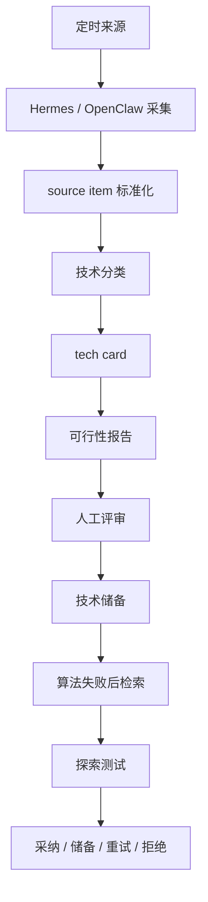

# 企业 AI 技术雷达

## 一句话概述

这是一个定时技术储备工作流，用于采集 AI/声学研究，结构化为可评审的技术卡片，并在算法开发中反向使用。

## 核心问题

快速变化的 AI 和声学技术容易被收集，但很难真正被使用。如果没有结构化技术储备，新论文和新仓库只是分散笔记，不能支撑工程决策。

## 工作流

## 入库对象

| 对象 | 用途 |
|---|---|
| `source_items` | 来自论文、仓库、手册、论坛和内部记录的标准化原始证据 |
| `tech_cards` | 面向决策的结构化技术卡片，包含场景匹配、成熟度、证据强度、依赖和风险 |
| `feasibility_reports` | 面向实验的报告，包含验证计划、预期工作量、集成风险和建议 |
| `review_tasks` | 不确定或高影响决策的人工评审队列 |

## 指标

| 指标 | 计算方式 |
|---|---|
| 每日有效条目数 | 每次定时任务 accepted source items |
| 重复率 | `duplicate_items / collected_items` |
| 抽取完整度 | `filled_required_fields / required_fields` |
| 评审通过率 | `accepted_cards / reviewed_cards` |
| Retrieval precision@K | `relevant_candidates_in_top_k / k` |
| 实验转化率 | `experiments_started / retrieved_candidates` |
| 技术胜率 | `accepted_techniques / tested_techniques` |
| 失败恢复耗时 | `report_time - failure_detected_time` |

## 当前状态

当前完成架构和量化设计。该项目定位为技术储备与决策工作流设计，不声明为成熟生产级情报平台。
